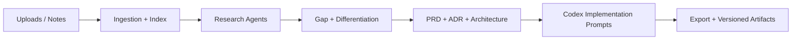

# AI Agent Builder


A single-user, production-focused system for turning rough product ideas
(pitch decks, docs, spreadsheets, notes) into a complete, implementation-ready
spec set: market research, competitive analysis, differentiation, PRD, ADRs,
architecture, and Codex-ready implementation prompts.

## What it does

- Ingests source material: PDFs, slides, docs, markdown, spreadsheets.
- Runs deep research and validation:
  - competitors, positioning, pricing signals, go-to-market constraints
  - feature gaps, differentiation opportunities, risk analysis
- Produces formal, versioned outputs:
  - PRD, architecture, ADRs, roadmap, build plan
  - Codex prompts structured for end-to-end production implementation
- Keeps an iterative project workspace so you can upload more material and
  re-run or refine outputs over time.

## High-level architecture



## Tech stack

- Runtime + tooling: Bun
- Web: Next.js 16 (App Router), React 19
- Styling/UI: TailwindCSS v4, shadcn/ui, Lucide
- AI: Vercel AI SDK v6 + AI Gateway
- DB: Neon Postgres + Drizzle ORM
- Infra helpers: Upstash (Redis, QStash, Vector)
- Quality: Biome (format/lint) + ESLint (TSDoc/JSDoc enforcement) + Vitest
- Typing/Schema: Zod v4
- Releases: Release Please (semver via Conventional Commits)

## Documentation

- Product requirements: [`PRD.md`](./PRD.md)
- Docs entrypoint: [`docs/README.md`](./docs/README.md)
- Architecture overview: [`docs/architecture/overview.md`](./docs/architecture/overview.md)
- Requirements catalog: [`docs/specs/requirements.md`](./docs/specs/requirements.md)
- SPEC index: [`docs/architecture/spec/index.md`](./docs/architecture/spec/index.md)
- ADR index: [`docs/architecture/adr/index.md`](./docs/architecture/adr/index.md)
- Security model: [`docs/architecture/security.md`](./docs/architecture/security.md)
- Operations/runbook: [`docs/architecture/runbook.md`](./docs/architecture/runbook.md)
- Agent/contribution standards: [`AGENTS.md`](./AGENTS.md)

## Local development

### Prerequisites

- Bun v1.2+ (uses `bun.lock`)
- A Neon database URL in `DATABASE_URL`
- Upstash credentials (Redis/Vector/QStash)
- Vercel AI Gateway API key (`AI_GATEWAY_API_KEY`)

### Setup

```bash
cp .env.example .env.local
bun install
bun run db:generate
bun run db:migrate
bun run dev
```

## Fetch AI Gateway model catalog

The AI Gateway exposes an OpenAI-compatible models endpoint:
`GET https://ai-gateway.vercel.sh/v1/models`

```bash
AI_GATEWAY_API_KEY=... bun run fetch:models
```

## CI and quality gates

Run the same checks as CI:

```bash
bun run format
bun run lint
bun run typecheck
bun run test
bun run build
```

## Releases and versioning

This repo uses Release Please and Conventional Commits.

While `version < 1.0.0`, breaking changes bump **minor** and features bump
**patch** (to avoid major releases during active development).

## How to cite

This repo includes a `CITATION.cff`. GitHub will surface a “Cite this repository”
entry when the file is present.

## Security

- CodeQL and OpenSSF Scorecard run in GitHub Actions.
- Dependency Review runs on PRs.
- Dependabot is configured for Bun lockfiles (`bun.lock`).
