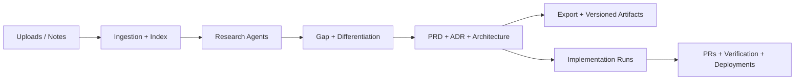

# AI Agent Builder


A private, production-focused system for turning rough product inputs (pitch
decks, docs, spreadsheets, notes) into a complete **implementation engine**:
research → specs → plan → code → verify → deploy (with a deterministic audit
trail).

## What it does

- Ingests source material: PDFs, slides, docs, markdown, spreadsheets.
- Supports deep research and validation (spec’d; web research integrations are not yet implemented).
- Maintains a formal architecture pack (PRD, ADRs, specs, security) in-repo (export is spec’d).
- Supports an implementation/deployment phase (spec’d) to:
  - connect a target GitHub repo
  - plan changes traceable to artifacts
  - apply patches + open PRs
  - run verification in Vercel Sandbox
  - provision/connect infra and deploy.

## High-level architecture



## Tech stack

- Runtime + tooling: Bun
- Web: Next.js 16 (App Router), React 19
- Styling/UI: TailwindCSS v4, shadcn/ui, Lucide
- Auth: Neon Auth (managed auth + UI components)
- AI: Vercel AI SDK v6 + AI Gateway
- DB: Neon Postgres + Drizzle ORM
- Orchestration: Vercel Workflow DevKit (interactive chat + runs), Upstash QStash (background ingestion)
- DB connectivity (Vercel): Postgres TCP + connection pooling (`pg`) with
  `attachDatabasePool` (`@vercel/functions`) for Fluid compute
  ([Vercel Functions package](https://vercel.com/docs/functions/functions-api-reference/vercel-functions-package),
  [Vercel KB: Connection Pooling with Vercel Functions](https://vercel.com/kb/guide/connection-pooling-with-functions))
- Infra helpers: Upstash (Redis, Vector)
- Quality: Biome (format/lint) + ESLint (TSDoc/JSDoc enforcement) + Vitest
- Typing/Schema: Zod v4
- Releases: Release Please (semver via Conventional Commits)

## Implementation engine (specs)

- End-to-end implementation runs: [`docs/architecture/spec/SPEC-0016-implementation-runs-end-to-end-build-and-deploy.md`](./docs/architecture/spec/SPEC-0016-implementation-runs-end-to-end-build-and-deploy.md)
- RepoOps (GitHub): [`docs/architecture/spec/SPEC-0017-repo-ops-and-github-integration.md`](./docs/architecture/spec/SPEC-0017-repo-ops-and-github-integration.md)
- Provisioning + deploy automation: [`docs/architecture/spec/SPEC-0018-infrastructure-provisioning-and-secrets-for-target-apps.md`](./docs/architecture/spec/SPEC-0018-infrastructure-provisioning-and-secrets-for-target-apps.md)
- Sandbox verification jobs: [`docs/architecture/spec/SPEC-0019-sandbox-build-test-and-ci-execution.md`](./docs/architecture/spec/SPEC-0019-sandbox-build-test-and-ci-execution.md)
- Workspace + search UX: [`docs/architecture/spec/SPEC-0020-project-workspace-and-search.md`](./docs/architecture/spec/SPEC-0020-project-workspace-and-search.md)
- GitOps + deploy ADRs:
  - [`docs/architecture/adr/ADR-0024-gitops-repository-automation-pr-based-workflows.md`](./docs/architecture/adr/ADR-0024-gitops-repository-automation-pr-based-workflows.md)
  - [`docs/architecture/adr/ADR-0025-infrastructure-provisioning-and-vercel-deployment-automation.md`](./docs/architecture/adr/ADR-0025-infrastructure-provisioning-and-vercel-deployment-automation.md)

### Auth dependency note

`@neondatabase/auth` is currently a beta package. We pin the version and treat
it as intentional: access is allowlisted, auth flows are covered by tests, and
we monitor upstream releases before upgrading.

## Documentation

- Start here: [`docs/README.md`](./docs/README.md)
- Product requirements: [`PRD.md`](./PRD.md)
- Architecture overview: [`docs/architecture/overview.md`](./docs/architecture/overview.md)
- Agent/contribution standards: [`AGENTS.md`](./AGENTS.md)

## Local development

### Prerequisites

- Bun v1.2+ (uses `bun.lock`)
- A Neon database URL in `DATABASE_URL`
- Neon Auth configured for this project:
  - Enable Neon Auth in the Neon Console and configure OAuth providers (GitHub, Vercel)
  - `NEON_AUTH_BASE_URL`
  - `NEON_AUTH_COOKIE_SECRET` (32+ chars; generate with `openssl rand -base64 32`)
  - `AUTH_ALLOWED_EMAILS` (when `AUTH_ACCESS_MODE=restricted`)
  - `NEXT_PUBLIC_AUTH_SOCIAL_PROVIDERS` (optional; if unset defaults to `github,vercel`)
    - Local/development: `vercel`
    - Preview: *(empty)* (disable social providers)
    - Production: `github,vercel`
- Upstash credentials (Redis/Vector/QStash)
- Vercel AI Gateway API key (`AI_GATEWAY_API_KEY`)

### Setup

```bash
cp .env.example .env.local
bun install
bun run dev
```

### Database migrations

Generate migrations (does not require a live DB connection):

```bash
bun run db:generate
```

Apply migrations (requires `DATABASE_URL`):

```bash
bun run db:migrate
```

Integration tests in `tests/integration/db.test.ts` run only when `DATABASE_URL`
is set; otherwise they are skipped.

Optional: implementation/deploy automation variables (GitHub/Vercel/Neon/Upstash)
are documented in [`docs/ops/env.md`](./docs/ops/env.md).

## Vercel Preview automation (optional)

This repo is designed to use the **Neon ↔ Vercel integration** for Preview
Branching (recommended). When enabled, Neon automatically provisions a database
branch per Vercel Preview branch and injects the branch-scoped Preview env vars
(`DATABASE_URL`, and (if Neon Auth is enabled) `NEON_AUTH_BASE_URL`).

To avoid GitHub OAuth’s “single callback URL per app” limitation on Preview
deployments, **disable** social providers on Preview deployments by setting
`NEXT_PUBLIC_AUTH_SOCIAL_PROVIDERS` to an empty string for the Vercel Preview
environment (global Preview default). Preview branches get a unique Neon Auth
URL, and Vercel OAuth requires exact callback URL allowlisting (not practical
per preview).

Optional: `.github/workflows/neon-auth-trusted-domains.yml` can automatically
ensure Neon Auth is enabled for the matching Neon preview branch
(`preview/<git-branch>`) and add the Preview deployment domain to Neon Auth
trusted domains (best-effort; non-blocking).

Required GitHub Actions configuration:

- Variables: `NEON_PROJECT_ID`
- Secrets: `NEON_API_KEY`, `VERCEL_TOKEN`, `VERCEL_PROJECT_ID` (optional: `VERCEL_TEAM_ID`)

## Fetch AI Gateway model catalog

The AI Gateway exposes an OpenAI-compatible models endpoint:
`GET https://ai-gateway.vercel.sh/v1/models`

```bash
AI_GATEWAY_API_KEY=... bun run fetch:models
```

## CI and quality gates

Run the same checks as CI:

```bash
bun run format
bun run lint
bun run typecheck
bun run test
bun run build
```

Tests are colocated under `src/**` (including route handler tests in
`src/app/api/**/__tests__`) with integration tests under
`tests/integration`.

## Releases and versioning

This repo uses Release Please and Conventional Commits.

While `version < 1.0.0`, breaking changes bump **minor** and features bump
**patch** (to avoid major releases during active development).

## How to cite

This repo includes a `CITATION.cff`. GitHub will surface a “Cite this repository”
entry when the file is present.

## Security

- CodeQL and OpenSSF Scorecard run in GitHub Actions.
- Dependency Review runs on PRs.
- Dependabot is configured for Bun lockfiles (`bun.lock`).
