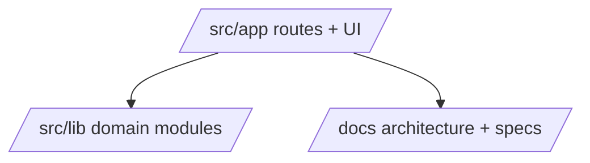

## Status

Accepted — 2026-01-30.

## Description

Adopt a single Next.js App Router repository to minimize overhead for a solo maintainer.

## Context

The system is used by one person and deployed as a single Vercel project. A monorepo introduces extra configuration, dependency management, and CI complexity without unlocking meaningful benefits at this stage. The current repo already reflects this decision (single app under `src/app`).

## Decision Drivers

- Solo-maintainer DX
- Low cognitive load
- Fast iteration
- Vercel deployment simplicity
- Bun-only toolchain consistency

## Alternatives

- A: Single Next.js repo — Pros: simplest; lowest overhead. Cons: fewer enforced package boundaries.
- B: Turborepo monorepo — Pros: scale to multiple apps/packages. Cons: extra tooling and coordination.
- C: Multi-repo — Pros: isolation. Cons: maximum ops overhead.

### Decision Framework

| Criterion | Weight | Score | Weighted |
| --- | --- | --- | --- |
| Solution leverage | 0.35 | 9.5 | 3.32 |
| Application value | 0.30 | 9.2 | 2.76 |
| Maintenance & cognitive load | 0.25 | 9.8 | 2.45 |
| Architectural adaptability | 0.10 | 9.1 | 0.91 |

**Total:** 9.45 / 10.0

## Decision

We will keep **a single Next.js App Router repository** for ai-agent-builder, using internal module boundaries (`src/lib/*`) rather than separate packages.

## Constraints

- Must remain deployable as a single Vercel project.
- Keep modules loosely coupled so later extraction is feasible.
- Keep scripts Bun-only.

## High-Level Architecture

## Related Requirements

### Functional Requirements

- **FR-002:** Project CRUD remains cohesive within one app.

### Non-Functional Requirements

- **NFR-003:** Maintainability via clear module boundaries and strict typing.
- **NFR-011:** Agent-first DX invariants in AGENTS.md.

### Performance Requirements

- **PR-001:** Streaming UX remains responsive.

### Integration Requirements

- **IR-010:** Bun-only scripts and installs.

## Design

### Architecture Overview

- Use `src/app/` for routes/UI and `src/app/api/*` for Route Handlers.
- Use `src/lib/*` modules for AI, ingestion, DB, Upstash, auth.

### Implementation Details

- Enforce lint/typecheck/test/build in CI.
- Prevent cyclic deps and create explicit dependency directions.

## Testing

- Unit: module boundaries, shared utilities.
- Integration: key API routes.
- E2E: login → project → upload → run → export flow (add Playwright).

## Implementation Notes

- Revisit monorepo only if a separate worker/CLI package becomes necessary.

## Consequences

### Positive Outcomes

- Faster setup and iteration
- Lower build and CI complexity
- Simpler deployment

### Negative Consequences / Trade-offs

- Less enforced package isolation

### Ongoing Maintenance & Considerations

- Monitor module coupling; keep boundaries clean

### Dependencies

- None

## Changelog

- **0.1 (2026-01-29)**: Initial version.
- **0.2 (2026-01-30)**: Updated for current repo baseline (Bun, `src/` layout, CI).
