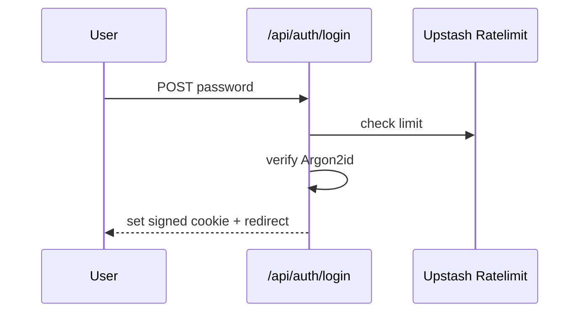

## Status

Accepted — 2026-01-30.

## Description

Use password-only auth with secure session cookies for a single user across devices.

## Context

OAuth/SSO adds unnecessary complexity and cost for a single-user internal tool. A password gate is sufficient if implemented with strong hashing, secure cookies, CSRF protections, and rate limiting.

## Decision Drivers

- Single-user requirement
- Low cost
- Low maintenance
- Brute-force resistance
- Server-only secrets

## Alternatives

- A: Single-password + signed cookie — Pros: minimal; cheap. Cons: not multi-user.
- B: Auth.js Credentials — Pros: standard. Cons: more config for no benefit.
- C: Provider-managed auth — Pros: managed identity. Cons: unnecessary overhead.

### Decision Framework

| Criterion | Weight | Score | Weighted |
| --- | --- | --- | --- |
| Solution leverage | 0.35 | 9.3 | 3.25 |
| Application value | 0.30 | 9.1 | 2.73 |
| Maintenance & cognitive load | 0.25 | 9.5 | 2.38 |
| Architectural adaptability | 0.10 | 9.0 | 0.90 |

**Total:** 9.26 / 10.0

## Decision

We will adopt **single-password authentication** using Argon2id hash verification and a signed httpOnly session cookie, rate-limited via Upstash Ratelimit.

## Constraints

- No secrets or auth state in client storage.
- Protect all routes except `/login` and static assets.
- Rate limit all auth endpoints.
- Cookie must be `httpOnly` and `Secure` in production.

## High-Level Architecture

## Related Requirements

### Functional Requirements

- **FR-001:** Single-user secure login across devices.

### Non-Functional Requirements

- **NFR-001:** Secure cookies; auth required for sensitive routes.
- **NFR-010:** Auth routes are CI-covered and linted.

### Performance Requirements

- **PR-001:** Fast auth response on warm path.

### Integration Requirements

- **IR-003:** Rate limiting via Upstash.

## Design

### Architecture Overview

- Middleware enforces session presence.
- Login uses Route Handler for verification.

### Implementation Details

- Store only a session identifier and issued-at timestamp in cookie.
- Rotate session secret via env var (`APP_SESSION_SECRET`).
- Optional: lockout after N failures per IP/time window.

### File locations (target)

- `src/app/(auth)/login/page.tsx`
- `src/app/api/auth/login/route.ts`
- `src/lib/auth/session.ts`

## Testing

- Unit: password verify and session serialization.
- Integration: middleware blocks unauthenticated routes.
- E2E: login/logout; brute-force throttling.

## Implementation Notes

- Password rotation requires updating `ADMIN_PASSWORD_HASH`.
- Ensure `Secure` cookie flag is enabled in production.

## Consequences

### Positive Outcomes

- Minimal auth complexity
- Low cost
- Reduced operational surface

### Negative Consequences / Trade-offs

- Not suitable for multi-user without redesign

### Ongoing Maintenance & Considerations

- Monitor auth logs and throttling behavior

### Dependencies

- **Added**: argon2, @upstash/ratelimit, @upstash/redis
- **Removed**: []

## Changelog

- **0.1 (2026-01-29)**: Initial version.
- **0.2 (2026-01-30)**: Updated for current repo baseline (Bun, `src/` layout, CI).
- **0.3 (2026-01-30)**: Renamed session secret var to `APP_SESSION_SECRET`.
