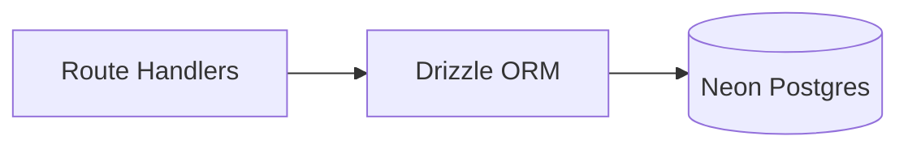

## Status

Accepted — 2026-01-30.

## Description

Use Neon Postgres for relational persistence and Drizzle for schema/migrations.

See [SPEC-0021](../spec/SPEC-0021-full-stack-finalization-fluid-compute-neon-upstash-ai-elements.md)
for the cross-cutting “finalization” plan that ties DB, ingestion, retrieval,
durable runs, and UI together.

## Context

We need durable storage for projects, files, runs, steps, artifacts, and chat state. Neon provides a serverless-friendly driver for Vercel deployments and strong DX via marketplace integration. Drizzle provides type-safe schema and migrations with low boilerplate. The repo is already configured via `drizzle.config.ts` to use `src/db/schema.ts`.

## Decision Drivers

- Relational integrity for runs/artifacts
- Serverless connectivity
- Type safety
- Low boilerplate
- Vercel integration

## Alternatives

- A: Neon + Drizzle — Pros: strong DX; Vercel-aligned pooling; serverless driver available where pooling isn’t safe. Cons: Drizzle learning curve.
- B: Neon + Prisma — Pros: popular. Cons: heavier generated layer.
- C: SQLite — Pros: local simplicity. Cons: poor cloud/serverless fit.

### Decision Framework

| Criterion | Weight | Score | Weighted |
| --- | --- | --- | --- |
| Solution leverage | 0.35 | 9.4 | 3.29 |
| Application value | 0.30 | 9.3 | 2.79 |
| Maintenance & cognitive load | 0.25 | 9.2 | 2.30 |
| Architectural adaptability | 0.10 | 9.4 | 0.94 |

**Total:** 9.32 / 10.0

## Decision

We will adopt **Neon Postgres** with **Drizzle ORM** for schema and migrations.

Connection method policy:

- On Vercel **Fluid compute**, use Postgres TCP with a connection pool (`pg`)
  and attach the pool via `attachDatabasePool`.
  - Implementation: `src/db/client.ts`
- In classic serverless environments where safe pooling is unavailable, Neon’s
  HTTP/WebSocket serverless driver is an acceptable alternative.

## Constraints

- Migrations must be deterministic and reviewed.
- Use SSL and safe connection parameters.
- Server-only DB access.
- Schema lives in `src/db/schema.ts`.

## High-Level Architecture

## Related Requirements

### Functional Requirements

- **FR-002:** Persist projects.
- **FR-011:** Persist run steps, citations, usage.
- **FR-014:** Persist artifacts and versions.

### Non-Functional Requirements

- **NFR-003:** Maintainability via schema-first approach.
- **NFR-004:** Observability fields stored per step.

### Performance Requirements

- **PR-004:** Durable runs independent of client.

### Integration Requirements

- **IR-002:** Neon is required.

## Design

### Architecture Overview

- `src/db/schema.ts`: schema definitions.
- `src/db/migrations/`: generated migrations.
- `src/db/client.ts`: Neon driver + Drizzle instance (implemented).
- `src/lib/data/*.server.ts`: server-only Data Access Layer (DAL) modules that
  encapsulate all DB reads/writes (implemented).

### Implementation Details

- UUID PKs, timestamps.
- JSONB for citations and usage.
- Index hot fields (`project_id`, `run_id`, `step_name`).
- Runtime driver: Postgres TCP with pooling (Vercel Fluid compute recommendation).
  - `pg` (node-postgres) + `drizzle-orm/node-postgres`.
  - On Vercel, we attach the pool using `@vercel/functions` to align with
    Vercel’s pooling semantics.
  - In classic serverless environments where connection pooling is unsafe,
    `@neondatabase/serverless` (HTTP/WebSocket) remains a viable alternative.

## Testing

- Integration: migration apply + CRUD.
- Regression: idempotent step updates maintain consistency.
  - Integration tests live in `tests/integration/db.test.ts` and run only when
    `DATABASE_URL` is available.

## Implementation Notes

- Prefer pooled Postgres TCP connections on Vercel Fluid compute (recommended).
- Keep pool sizes conservative to avoid exhausting Neon connection limits.
- If deploying to a classic serverless platform without safe pooling, switch to
  the Neon serverless driver (HTTP/WebSocket).

## Consequences

### Positive Outcomes

- Strong relational consistency
- Good Vercel integration
- Type-safe schema/migrations

### Negative Consequences / Trade-offs

- Extra service alongside Upstash

### Ongoing Maintenance & Considerations

- Review and squash migrations periodically
- Monitor query performance for large projects

### Dependencies

- **Added**: drizzle-orm, drizzle-kit, pg, @vercel/functions

## Changelog

- **0.1 (2026-01-29)**: Initial version.
- **0.2 (2026-01-30)**: Updated for current repo baseline (Bun, `src/` layout, CI).
- **0.3 (2026-02-03)**: Updated connection method policy for Vercel Fluid compute (TCP pooling + `attachDatabasePool`).
- **0.4 (2026-02-03)**: Linked to SPEC-0021 as the cross-cutting finalization spec.
