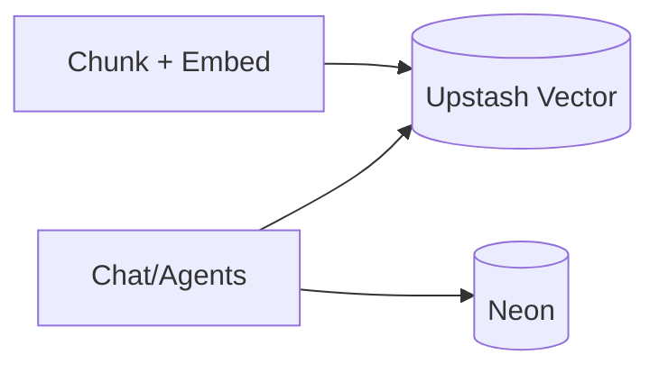

## Status

Accepted — 2026-01-30.

## Description

Use Upstash Vector for semantic retrieval across uploads and artifacts.

## Context

System quality depends on grounding responses in uploaded sources and previously generated artifacts. A dedicated vector store with metadata filters and namespaces provides fast similarity search without complex DB tuning.

## Decision Drivers

- RAG quality
- Low ops serverless vector store
- Metadata filtering
- AI SDK ecosystem alignment

## Alternatives

- A: Upstash Vector — Pros: serverless; AI SDK integration. Cons: external dependency.
- B: Neon + pgvector — Pros: single DB. Cons: more tuning and scaling concerns.
- C: Dedicated vector DB — Pros: powerful. Cons: higher cost/ops for single-user.

### Decision Framework

| Criterion | Weight | Score | Weighted |
| --- | --- | --- | --- |
| Solution leverage | 0.35 | 9.3 | 3.25 |
| Application value | 0.30 | 9.5 | 2.85 |
| Maintenance & cognitive load | 0.25 | 9.1 | 2.27 |
| Architectural adaptability | 0.10 | 9.2 | 0.92 |

**Total:** 9.30 / 10.0

## Decision

We will adopt **Upstash Vector** with per-project namespaces for chunks and artifacts, storing canonical text and citations in Neon.

## Constraints

- Maintain deletion hygiene (remove vector entries on project delete).
- Keep namespaces stable.
- Store canonical text in DB for audit/export.

## High-Level Architecture

## Related Requirements

### Functional Requirements

- **FR-007:** Embed and index chunks.
- **FR-019:** Retrieval knowledge base.

### Non-Functional Requirements

- **NFR-006:** Cost controls via bounded top-k and caching.

### Performance Requirements

- **PR-002:** Retrieval latency p95 <= 250ms (warm).

### Integration Requirements

- **IR-005:** Upstash Vector required.

## Design

### Architecture Overview

- `src/lib/upstash/vector.ts`: client + helper functions (namespace, upsert, query, delete).

### Implementation Details

- Deterministic vector IDs for idempotency: `{{fileId}}:{{chunkIndex}}`.
- Metadata filters: `projectId`, `fileId`, `type`.
- Keep top-k small and rerank in-model if needed.

## Testing

- Integration: upsert then query returns expected items.
- Regression: delete project removes namespace entries.
- Performance: measure p95 retrieval under warm cache.

## Implementation Notes

- Store content hashes to avoid redundant embedding computation.
- Prefer async embedding with QStash for large files.

## Consequences

### Positive Outcomes

- Fast RAG retrieval
- Low operational overhead
- Scales with usage

### Negative Consequences / Trade-offs

- Additional vendor dependency

### Ongoing Maintenance & Considerations

- Monitor index size and implement retention policies
- Review embedding model changes for re-index triggers

### Dependencies

- **Added**: @upstash/vector
- **Removed**: []

## Changelog

- **0.1 (2026-01-29)**: Initial version.
- **0.2 (2026-01-30)**: Updated for current repo baseline (Bun, `src/` layout, CI).
