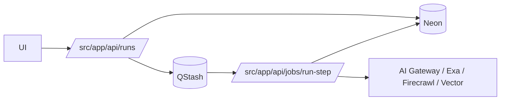

## Status

Accepted — 2026-01-30.

## Description

Use QStash to execute multi-step runs durably and idempotently.

## Context

Full spec generation and research can exceed route execution limits. Durable orchestration ensures work completes even if the user closes the browser. QStash provides serverless-friendly HTTP-based queueing, signature verification, and retries.

## Decision Drivers

- Durability
- Retry semantics
- Serverless-friendly
- Secure job triggers

## Alternatives

- A: QStash — Pros: HTTP queue; retries; serverless-friendly. Cons: external dependency.
- B: Vercel Cron + polling — Pros: simple. Cons: weak durability/visibility.
- C: Temporal — Pros: robust workflows. Cons: heavy ops overhead.

### Decision Framework

| Criterion | Weight | Score | Weighted |
| --- | --- | --- | --- |
| Solution leverage | 0.35 | 9.2 | 3.22 |
| Application value | 0.30 | 9.4 | 2.82 |
| Maintenance & cognitive load | 0.25 | 9.2 | 2.30 |
| Architectural adaptability | 0.10 | 9.1 | 0.91 |

**Total:** 9.25 / 10.0

## Decision

We will use **Upstash QStash** to orchestrate run steps, verifying signatures and enforcing step idempotency.

## Constraints

- Step endpoints must verify QStash signatures.
- Verification requires `QSTASH_CURRENT_SIGNING_KEY` and `QSTASH_NEXT_SIGNING_KEY`.
- Steps must be idempotent per (runId, stepName).
- Ensure at-least-once delivery does not duplicate artifacts.

## High-Level Architecture

## Related Requirements

### Functional Requirements

- **FR-010:** Durable run execution.
- **FR-011:** Persist step status and outputs.

### Non-Functional Requirements

- **NFR-004:** Observability for each step.
- **NFR-005:** Deterministic artifacts per step.

### Performance Requirements

- **PR-004:** Runs survive disconnects.
- **PR-005:** Idempotent steps.

### Integration Requirements

- **IR-004:** Use QStash.

## Design

### Architecture Overview

- A run is a DB record with ordered steps.
- Each step handler acquires a DB lease, executes, writes outputs, and marks status.

### Implementation Details

- Store `attempt` and `error` in `run_steps`.
- Provide a UI action to retry a failed step.
- Cap maximum retries and enforce budgets.

### File locations (target)

- `src/app/api/runs/route.ts`
- `src/app/api/jobs/run-step/route.ts`

## Testing

- Integration: replay same step twice yields identical artifacts.
- Contract: unsigned requests rejected.
- E2E: run completes after client disconnect.

## Implementation Notes

- Keep steps small; offload heavy analysis to Sandbox as a sub-step.

## Consequences

### Positive Outcomes

- Durable workflows without heavy infra
- Clean retry semantics
- Serverless-aligned

### Negative Consequences / Trade-offs

- Extra integration and signature verification complexity

### Ongoing Maintenance & Considerations

- Monitor failed steps and provider outages
- Keep step graph explicit and versioned

### Dependencies

- **Added**: @upstash/qstash

## Changelog

- **0.1 (2026-01-29)**: Initial version.
- **0.2 (2026-01-30)**: Updated for current repo baseline (Bun, `src/` layout, CI).
