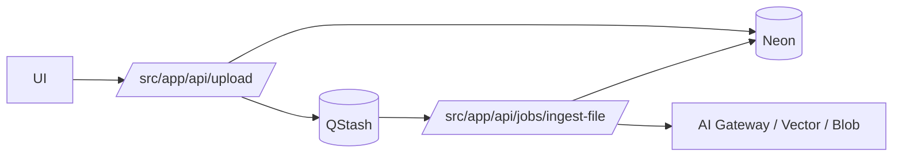

## Status

Accepted — 2026-01-30.
Updated — 2026-02-03: re-scoped to background jobs (ingestion + fanout); interactive runs moved to ADR-0026.

## Description

Use QStash to execute **background jobs** durably and idempotently, with signed
delivery, retries, and rate limiting.

This ADR no longer governs **interactive runs or chat streaming**. Those are
handled by Vercel Workflow DevKit per [ADR-0026](./ADR-0026-orchestration-vercel-workflow-devkit-for-interactive-runs.md).

See [SPEC-0021](../spec/SPEC-0021-full-stack-finalization-fluid-compute-neon-upstash-ai-elements.md)
for the cross-cutting “finalization” plan that ties QStash orchestration into
ingestion, UI, and background step execution patterns.

## Context

Ingestion and other background jobs (extract/chunk/embed/index) can exceed route
execution limits and should continue even if the user closes the browser. QStash
provides serverless-friendly HTTP-based queueing, signature verification, and
retries.

## Decision Drivers

- Durability
- Retry semantics
- Serverless-friendly
- Secure job triggers

## Alternatives

- A: QStash — Pros: HTTP queue; retries; serverless-friendly. Cons: external dependency.
- B: Vercel Cron + polling — Pros: simple. Cons: weak durability/visibility.
- C: Temporal — Pros: robust workflows. Cons: heavy ops overhead.

### Decision Framework

| Criterion | Weight | Score | Weighted |
| --- | --- | --- | --- |
| Solution leverage | 0.35 | 9.2 | 3.22 |
| Application value | 0.30 | 9.4 | 2.82 |
| Maintenance & cognitive load | 0.25 | 9.2 | 2.30 |
| Architectural adaptability | 0.10 | 9.1 | 0.91 |

**Total:** 9.25 / 10.0

## Decision

We will use **Upstash QStash** to orchestrate background jobs (primarily the ingestion pipeline), verifying signatures and enforcing idempotency.

## Constraints

- Background job endpoints must verify QStash signatures.
- Verification requires `QSTASH_CURRENT_SIGNING_KEY` and `QSTASH_NEXT_SIGNING_KEY`.
- Jobs must be idempotent (e.g., by `(fileId, stage)` and/or content hash).
- Ensure at-least-once delivery does not duplicate artifacts.

## High-Level Architecture

## Related Requirements

### Functional Requirements

- **FR-003:** Upload files to a project.
- **FR-004:** Store original files durably.
- **FR-005:** Extract text + structural metadata.
- **FR-006:** Chunk extracted content.
- **FR-007:** Embed + index chunks in vector store.

### Non-Functional Requirements

- **NFR-004:** Observability for each step.
- **NFR-006:** Cost controls for background processing.

### Performance Requirements

- **PR-005:** Idempotent steps.
- **PR-003:** Ingest 10 MB PDF within target (excluding queue delay).

### Integration Requirements

- **IR-004:** Use QStash.

## Design

### Architecture Overview

QStash is used to deliver background processing jobs (ingestion and related
fanout tasks) reliably:

- upload endpoint publishes a QStash message referencing the file/project
- ingestion worker verifies the signature, loads state from DB, and advances the pipeline
- retries are expected; all operations must be idempotent

The ingestion pipeline details are defined in:

- [SPEC-0003](../spec/SPEC-0003-upload-ingestion-pipeline.md)
- [SPEC-0021](../spec/SPEC-0021-full-stack-finalization-fluid-compute-neon-upstash-ai-elements.md)

### Implementation Details

- Verify QStash signatures on every background job route.
- Enforce idempotency at the file/content hash boundary (avoid double indexing).
- Cap retries and enforce budgets to avoid runaway costs.

### File locations (target)

- `src/app/api/upload/route.ts`
- `src/app/api/jobs/ingest-file/route.ts`

## Testing

- Contract: unsigned requests rejected.
- Integration: replay same job twice yields the same DB/vector state (idempotent).
- E2E: ingestion completes after client disconnect.

## Implementation Notes

- Keep steps small; offload heavy analysis to Sandbox as a sub-step.

## Consequences

### Positive Outcomes

- Durable workflows without heavy infra
- Clean retry semantics
- Serverless-aligned

### Negative Consequences / Trade-offs

- Extra integration and signature verification complexity

### Ongoing Maintenance & Considerations

- Monitor failed steps and provider outages
- Keep step graph explicit and versioned

### Dependencies

- **Added**: @upstash/qstash

## Changelog

- **0.1 (2026-01-29)**: Initial version.
- **0.2 (2026-01-30)**: Updated for current repo baseline (Bun, `src/` layout, CI).
- **0.3 (2026-02-03)**: Linked to SPEC-0021 as the cross-cutting finalization spec.
- **0.4 (2026-02-03)**: Re-scoped to background jobs (ingestion + fanout); interactive runs moved to ADR-0026.
