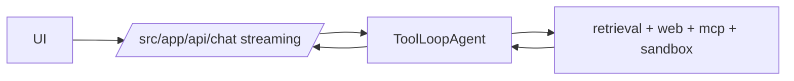

## Status

Accepted — 2026-01-30.

## Description

Use AI SDK v6 agents for multi-step tool loops and streaming chat UX.

See [SPEC-0021](../spec/SPEC-0021-full-stack-finalization-fluid-compute-neon-upstash-ai-elements.md)
for the cross-cutting “finalization” plan that ties agent streaming into the
workspace UI, retrieval, caching, and durable orchestration.

## Context

The system requires multi-step reasoning and tool usage. AI SDK v6 provides ToolLoopAgent for iterative tool calls and createAgentUIStreamResponse for streaming message parts to the UI in Next.js Route Handlers.

## Decision Drivers

- Multi-step tool loops
- Streaming UX
- Type-safe tools
- Ecosystem alignment with AI Elements

## Alternatives

- A: AI SDK v6 agents — Pros: first-class for Next.js; streaming; tools. Cons: SDK-specific patterns.
- B: LangChain agents — Pros: broad ecosystem. Cons: more abstraction and less UI alignment.
- C: Custom agent loop — Pros: full control. Cons: high maintenance.

### Decision Framework

| Criterion | Weight | Score | Weighted |
| --- | --- | --- | --- |
| Solution leverage | 0.35 | 9.6 | 3.36 |
| Application value | 0.30 | 9.7 | 2.91 |
| Maintenance & cognitive load | 0.25 | 9.1 | 2.27 |
| Architectural adaptability | 0.10 | 9.3 | 0.93 |

**Total:** 9.47 / 10.0

## Decision

We will implement agents using **ToolLoopAgent** and stream UI output using **createAgentUIStreamResponse** in Route Handlers.

## Constraints

- Tool execution must be server-side only.
- Agent loops must enforce max steps and budgets.
- Streaming must handle disconnects gracefully.
- Persist tool usage and citations per step.

## High-Level Architecture

## Related Requirements

### Functional Requirements

- **FR-008:** streaming chat.
- **FR-009:** agent modes.
- **FR-010:** multi-step workflows.

### Non-Functional Requirements

- **NFR-003:** strict TS and clear tool types.
- **NFR-004:** log tool calls and usage.

### Performance Requirements

- **PR-001:** fast streaming start.
- **PR-004:** durable runs via QStash.

### Integration Requirements

- **IR-001:** model calls via AI Gateway.

## Design

### Architecture Overview

- `src/lib/ai/agents/registry.ts` returns configured agents per mode.
- Each agent receives only the minimal tools required.

### Implementation Details

- Use call options for per-step tuning.
- Persist tool invocations and results summaries to `run_steps.tool_calls`.
- Keep prompts in `src/lib/ai/agents/prompts/*` for reuse/versioning.

## Testing

- Unit: agent registry tool exposure.
- Integration: chat route streams message parts.
- Regression: tool calls are only present for allowed modes.

## Implementation Notes

- Avoid tool bloat by using `dynamicTool()` for optional tools.

## Consequences

### Positive Outcomes

- Strong streaming UX primitives
- Robust tool-loop abstraction
- Matches Vercel AI UI ecosystem

### Negative Consequences / Trade-offs

- SDK lock-in (acceptable here)

### Ongoing Maintenance & Considerations

- Track AI SDK updates and avoid deprecated APIs

### Dependencies

- **Added**: ai

## Changelog

- **0.1 (2026-01-29)**: Initial version.
- **0.2 (2026-01-30)**: Updated for current repo baseline (Bun, `src/` layout, CI).
- **0.3 (2026-02-03)**: Linked to SPEC-0021 as the cross-cutting finalization spec.
