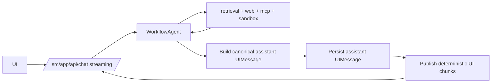

## Status

Accepted — 2026-01-30.
Updated — 2026-02-03: aligned with Workflow DevKit durable sessions and resumable streaming (ADR-0026).
Implemented — 2026-02-05.
Updated — 2026-07-13: migrated project chat to AI SDK 7 `WorkflowAgent` and buffered durable publication.

## Description

Use AI SDK 7 agents for multi-step tool loops and streaming chat UX.

See [SPEC-0021](../spec/SPEC-0021-full-stack-finalization-fluid-compute-neon-upstash-ai-elements.md)
for the cross-cutting “finalization” plan that ties agent streaming into the
workspace UI, retrieval, caching, and durable orchestration.

See [SPEC-0022](../spec/SPEC-0022-vercel-workflow-durable-runs-and-streaming-contracts.md)
for the canonical Workflow DevKit integration (durable multi-turn sessions,
resumable streams, hook endpoints).

## Context

The system requires multi-step reasoning, typed tools, durable model calls, and resumable UI streams. AI SDK 7 provides the agent and UI-message contracts, while `@ai-sdk/workflow` adapts model calls to Workflow DevKit execution.

Project chat uses `WorkflowAgent` without exposing its in-flight attempt stream.
After a durable model call completes, workflow steps build one canonical assistant
`UIMessage`, persist it, and only then publish deterministic chunks to the
default workflow stream. The default stream therefore remains one stable
`UIMessageChunk` cursor space for reconnection, and a retried model attempt
cannot leak a second public response.

## Decision Drivers

- Multi-step tool loops
- Streaming UX
- Type-safe tools
- Ecosystem alignment with AI Elements

## Alternatives

- A: AI SDK 7 + `@ai-sdk/workflow`: first-class AI SDK contracts, durable calls, and native stream conversion; SDK-specific patterns.
- B: LangChain agents: broad ecosystem; more abstraction and less UI alignment.
- C: Custom agent loop: full control; high maintenance.

### Decision Framework

| Criterion | Weight | Score | Weighted |
| --- | --- | --- | --- |
| Solution leverage | 0.35 | 9.6 | 3.36 |
| Application value | 0.30 | 9.7 | 2.91 |
| Maintenance & cognitive load | 0.25 | 9.1 | 2.27 |
| Architectural adaptability | 0.10 | 9.3 | 0.93 |

**Total:** 9.47 / 10.0

## Decision

Use **AI SDK 7 agents** and **AI SDK UI message streams**. Project chat runs a `WorkflowAgent` from `@ai-sdk/workflow`; Code Mode and implementation planning use AI SDK `ToolLoopAgent` directly inside workflow steps.

Buffer each project-chat model result inside `WorkflowAgent`. Build and persist
one canonical assistant message before deterministic publication, suppress
per-turn `finish` chunks, and close the default stream once when the chat
session ends.

## Constraints

- Tool execution must be server-side only.
- Agent loops must enforce max steps and budgets.
- Streaming must handle disconnects gracefully.
- Persist tool usage and citations per step.

## High-Level Architecture

## Related Requirements

### Functional Requirements

- **FR-008:** streaming chat.
- **FR-009:** agent modes.
- **FR-010:** multi-step workflows.

### Non-Functional Requirements

- **NFR-003:** strict TS and clear tool types.
- **NFR-004:** log tool calls and usage.

### Performance Requirements

- **PR-001:** fast streaming start.
- **PR-004:** durable runs and resumable streams (Workflow DevKit).

### Integration Requirements

- **IR-001:** model calls via AI Gateway.

## Design

### Architecture Overview

- `src/lib/ai/agents/registry.server.ts` returns configured modes.
- `src/lib/ai/tools/factory.server.ts` builds a fresh allowlisted, budgeted toolset for each assistant turn.
- `src/workflows/chat/project-chat.workflow.ts` owns the multi-turn workflow and
  orders build, persistence, and publication for each agent result.
- `src/workflows/chat/steps/assistant-turn-stream.step.ts` builds the canonical
  assistant message and publishes deterministic chunks after persistence.

### Implementation Details

- Limit loops with `isStepCount` and restrict each call with `activeTools`.
- Pass immutable tool scope through AI SDK 7 `toolsContext`; validate scoped tools with `contextSchema`.
- Use deterministic assistant message IDs: `assistant:{workflowRunId}:{turnNumber}`.
- Keep the default workflow stream typed as `UIMessageChunk` so `startIndex` resumes the exact client-visible cursor.

## Testing

- Unit: agent registry tool exposure and per-turn tool budgets.
- Unit: completed agent steps build one persisted assistant message and the
  expected deterministic outer UI chunks.
- Integration: chat route streams message parts and resumes from `startIndex`.
- Regression: tool calls are only present for allowed modes.

## Implementation Notes

- Define tools once with AI SDK `tool()`, then expose only the selected mode's allowlisted tools.

## Consequences

### Positive Outcomes

- Strong streaming UX primitives
- Robust tool-loop abstraction
- Matches Vercel AI UI ecosystem

### Negative Consequences / Trade-offs

- SDK lock-in (acceptable here)

### Ongoing Maintenance & Considerations

- Track AI SDK updates and avoid deprecated APIs

### Dependencies

- **Added**: `ai`, `@ai-sdk/workflow`, `workflow`

## Changelog

- **0.1 (2026-01-29)**: Initial version.
- **0.2 (2026-01-30)**: Updated for current repo baseline (Bun, `src/` layout, CI).
- **0.3 (2026-02-03)**: Linked to SPEC-0021 as the cross-cutting finalization spec.
- **0.4 (2026-02-03)**: Updated for Workflow DevKit durable sessions + resumable streaming alignment.
- **0.5 (2026-07-13)**: Migrated project chat to AI SDK 7 `WorkflowAgent`, native model-to-UI stream conversion, and exact assistant-message persistence.
- **0.6 (2026-07-13)**: Buffered model results behind persistence and made
  public assistant publication deterministic and retry-safe.
