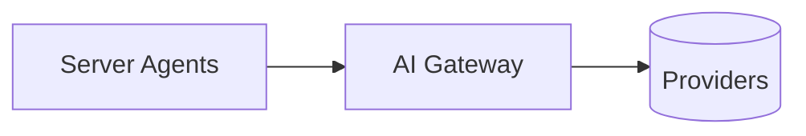

## Status

Accepted — 2026-01-30.

## Description

Route all text and embedding requests through AI Gateway for unified routing, budgets, and monitoring.

## Context

Using multiple provider SDKs complicates secrets and routing. AI Gateway offers a unified API across models/providers and supports centralized budgets and monitoring. The repo includes a script to fetch the model catalog (`scripts/fetch-models.sh`).

## Decision Drivers

- Unified model endpoint
- Budgeting and monitoring
- Provider flexibility
- Simpler secrets management

## Alternatives

- A: AI Gateway — Pros: unified API, budgets, fallbacks. Cons: gateway dependency.
- B: Direct provider SDKs — Pros: direct features. Cons: multiple keys and routing logic.
- C: Self-hosted gateway — Pros: full control. Cons: high ops.

### Decision Framework

| Criterion | Weight | Score | Weighted |
| --- | --- | --- | --- |
| Solution leverage | 0.35 | 9.5 | 3.32 |
| Application value | 0.30 | 9.6 | 2.88 |
| Maintenance & cognitive load | 0.25 | 9.1 | 2.27 |
| Architectural adaptability | 0.10 | 9.5 | 0.95 |

**Total:** 9.43 / 10.0

## Decision

We will use **Vercel AI Gateway** for all model and embedding calls and persist usage metadata per step.

## Constraints

- Do not store provider keys in client.
- Do not hardcode model IDs permanently; allow config-driven selection.
- Enforce per-run budgets and max steps.
- Maintain a cached model catalog JSON for deterministic UI defaults.

## High-Level Architecture

## Related Requirements

### Functional Requirements

- **FR-007:** embeddings through gateway.
- **FR-011:** persist model usage.
- **FR-021:** fetch model catalog for UI.

### Non-Functional Requirements

- **NFR-006:** enforce budgets/cost controls.

### Performance Requirements

- **PR-001:** latency managed via caching and appropriate model selection.

### Integration Requirements

- **IR-001:** gateway required.

## Design

### Architecture Overview

- `src/lib/ai/gateway.ts` exposes model factories and model listing for UI.
- `scripts/fetch-models.sh` fetches `/models` into `docs/ai-gateway-models.json`.

### Implementation Details

- Persist `model`, `provider`, `token_usage`, `latency_ms` in run steps.
- Provide run-level budget checks before expensive steps.

## Testing

- Integration: gateway provider call works in preview/prod.
- Regression: direct provider SDK usage not present.
- Contract: usage persisted per step.

## Implementation Notes

- Prefer OIDC auth on Vercel deployments when supported by provider.

## Consequences

### Positive Outcomes

- Centralized routing and budgets
- Simpler secrets management
- Provider flexibility

### Negative Consequences / Trade-offs

- Gateway availability dependency

### Ongoing Maintenance & Considerations

- Keep fallback routing policies in AI Gateway up to date
- Refresh model catalog JSON when routing policies change

### Dependencies

- **Added**: @ai-sdk/gateway
- **Removed**: direct provider SDKs (if any)

## Changelog

- **0.1 (2026-01-29)**: Initial version.
- **0.2 (2026-01-30)**: Updated for current repo baseline (Bun, `src/` layout, CI).
