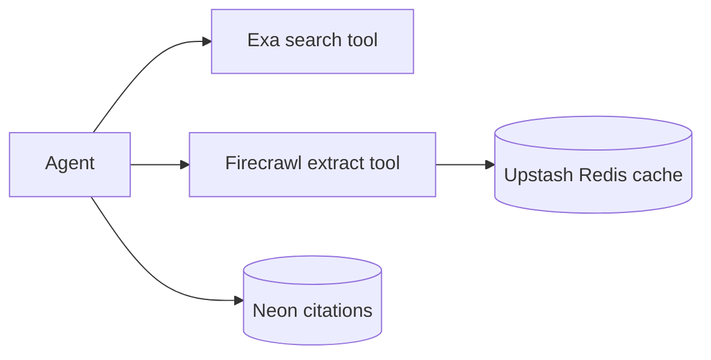

## Status

Implemented — 2026-02-07.

## Description

Use Exa for search and Firecrawl for page extraction, enforcing citation capture per claim.

## Context

Market validation and competitive research require up-to-date web information. We need reliable search results plus robust extraction to get clean content for summarization.

## Decision Drivers

- High-quality search
- Reliable extraction
- Citation enforcement
- Low maintenance surface area (thin wrappers + caching)

## Alternatives

- A: Exa + Firecrawl — Pros: purpose-built; AI SDK tools. Cons: two vendors.
- B: Only search (no extraction) — Pros: simpler. Cons: low quality grounding.
- C: Scrape manually — Pros: control. Cons: high maintenance and fragility.

### Decision Framework

| Criterion | Weight | Score | Weighted |
| --- | --- | --- | --- |
| Solution leverage | 0.35 | 9.2 | 3.22 |
| Application value | 0.30 | 9.6 | 2.88 |
| Maintenance & cognitive load | 0.25 | 9.1 | 2.27 |
| Architectural adaptability | 0.10 | 9.1 | 0.91 |

**Total:** 9.29 / 10.0

## Decision

We will adopt **Exa** for search and **Firecrawl** for content extraction, capturing source URLs and minimal excerpts for citations.

## Constraints

- Respect robots and provider terms.
- Do not store full copyrighted articles; store snippets + summaries.
- Enforce max URLs per step and cache results.

## High-Level Architecture

## Related Requirements

### Functional Requirements

- **FR-012:** Web research with citations.

### Non-Functional Requirements

- **NFR-006:** tool-call caps and caching.
- **NFR-004:** persist citations.

### Performance Requirements

- **PR-001:** fast stream start with incremental research.

### Integration Requirements

- **IR-007:** Exa and Firecrawl required.

## Design

### Architecture Overview

- `src/lib/ai/tools/web-search.server.ts` wraps Exa queries.
- `src/lib/ai/tools/web-extract.server.ts` wraps Firecrawl extraction.
- Cache by `(tool, params)` in Upstash Redis.

### Implementation Details

- Store citations as `{url, title, publishedAt?, accessedAt, excerpt}`.
- Link citations to artifacts (not chat messages) for auditing/export.
- Render citations in artifact markdown via `citation:n` links.

## Testing

- Contract tests: tool returns normalized citation record.
- Integration: cached fetch avoids repeated extraction.
- Regression: tool limits enforced.

## Implementation Notes

- If sources disagree, record both and present uncertainty.

## Consequences

### Positive Outcomes

- High-quality and current research
- Cleaner extracted text
- Less custom scraping code

### Negative Consequences / Trade-offs

- External API costs
- Need careful caching and tool limits

### Ongoing Maintenance & Considerations

- Monitor API quota usage
- Update extraction profiles if HTML changes

### Dependencies

- **Added**: `exa-js`, `@mendable/firecrawl-js`

## Changelog

- **0.1 (2026-01-29)**: Initial version.
- **0.2 (2026-01-30)**: Updated for current repo baseline (Bun, `src/` layout, CI).
- **0.3 (2026-02-07)**: Implemented with server wrappers, caching, budgets, and artifact-linked citations.
