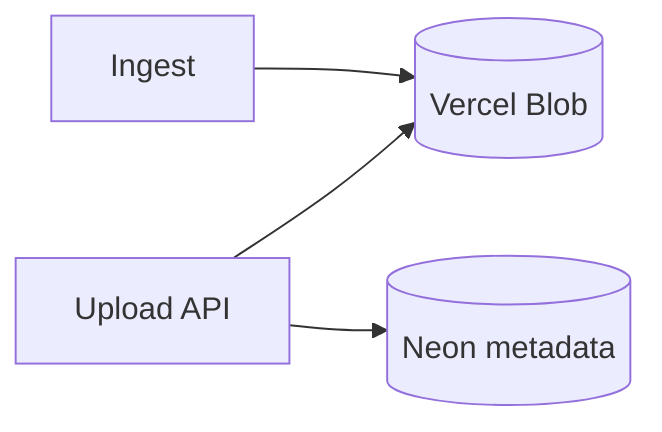

## Status

Accepted — 2026-01-30.

## Description

Store uploaded originals durably in Vercel Blob and persist metadata in Neon.

## Context

Uploads include PDFs, decks, and spreadsheets that must be preserved for auditing and re-processing. Storing originals in Postgres is expensive and slow. Vercel Blob provides a managed object store with good Vercel integration.

## Decision Drivers

- Durable object storage
- Vercel integration
- Low ops
- Fast downloads

## Alternatives

- A: Vercel Blob — Pros: Vercel-native; simple. Cons: new dependency.
- B: S3/R2 — Pros: flexible. Cons: more setup and keys.
- C: DB storage — Pros: single system. Cons: poor cost/perf for large files.

### Decision Framework

| Criterion | Weight | Score | Weighted |
| --- | --- | --- | --- |
| Solution leverage | 0.35 | 9.1 | 3.18 |
| Application value | 0.30 | 9.4 | 2.82 |
| Maintenance & cognitive load | 0.25 | 9.2 | 2.30 |
| Architectural adaptability | 0.10 | 9.1 | 0.91 |

**Total:** 9.21 / 10.0

## Decision

We will store originals in **Vercel Blob** and store blob URL, size, mime type, and hash metadata in Neon.

## Constraints

- Never expose private blob URLs to unauthenticated users.
- Enforce file type and size limits.
- Deleting a project must delete blob objects.

## High-Level Architecture

## Related Requirements

### Functional Requirements

- **FR-003:** upload files.
- **FR-004:** store originals durably.

### Non-Functional Requirements

- **NFR-007:** deletion hygiene.
- **NFR-001:** secure access control.

### Performance Requirements

- **PR-003:** ingest large files within budget.

### Integration Requirements

- **IR-006:** use Vercel Blob.

## Design

### Architecture Overview

- Use server-side upload (no client keys).
- Compute SHA-256 hash for idempotency.

### Implementation Details

- `src/app/api/upload/route.ts`: streams to Blob.
- `src/lib/blob/client.ts`: wrapper with typed metadata.
- Persist `blobUrl`, `sha256`, `sizeBytes`, `mimeType`.

## Testing

- Integration: upload then download returns identical hash.
- Security: unauthenticated access blocked.
- Regression: delete project removes blob objects.

## Implementation Notes

- Consider chunked uploads for very large files if needed.

## Consequences

### Positive Outcomes

- Durable storage with low ops
- Avoids DB bloat

### Negative Consequences / Trade-offs

- Separate storage system to manage

### Ongoing Maintenance & Considerations

- Monitor storage usage and cleanups
- Ensure blob delete is reliable

### Dependencies

- **Added**: @vercel/blob

## Changelog

- **0.1 (2026-01-29)**: Initial version.
- **0.2 (2026-01-30)**: Updated for current repo baseline (Bun, `src/` layout, CI).
