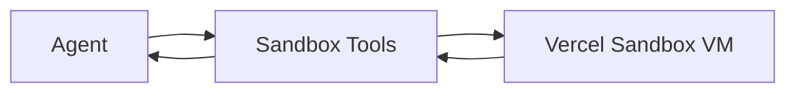

## Status

Accepted — 2026-01-30.  
Implemented — 2026-02-01 (implementation verification jobs).  
Updated — 2026-02-09 (sandbox module layout + auth contract + ctx-zip binding).

## Description

Run untrusted code and heavy tasks in isolated Sandbox VMs.

This includes:

- analysis tasks (“Code Mode”)
- ingestion helpers for unusual formats (if needed)
- **implementation verification jobs** (lint/typecheck/test/build/migrations) for
  end-to-end Implementation Runs

## Context

Some steps require code execution (e.g., data analysis, parsing unusual formats,
validating generated artifacts, running repo verification).

Running arbitrary code in server functions is unsafe. Vercel Sandbox provides
isolated execution environments with time and resource controls, and AI SDK tools
reduce the need to build custom exec infrastructure.

## Decision Drivers

- Security isolation
- Deterministic execution
- Tooling leverage
- Works in serverless workflows

## Alternatives

- A: Vercel Sandbox + AI SDK tools — Pros: safe isolation; managed. Cons: cost per run.
- B: Local-only execution — Pros: no cloud cost. Cons: not available from phone/laptop.
- C: Self-host containers — Pros: control. Cons: heavy ops for solo user.

### Decision Framework

| Criterion | Weight | Score | Weighted |
| --- | --- | --- | --- |
| Solution leverage | 0.35 | 9.2 | 3.22 |
| Application value | 0.30 | 9.3 | 2.79 |
| Maintenance & cognitive load | 0.25 | 9.0 | 2.25 |
| Architectural adaptability | 0.10 | 9.2 | 0.92 |

**Total:** 9.18 / 10.0

## Decision

We will use **Vercel Sandbox** as the canonical execution environment for any
command/code execution in the product.

Use AI SDK tools where it reduces implementation effort:

- `bash-tool` for shell commands
- `ai-sdk-tool-code-execution` for Python execution
- `ctx-zip` for context packaging and summarization of large directories

## Constraints

- Never execute user-provided code outside Sandbox.
- Enforce timeout and resource limits.
- Restrict filesystem access and network egress as supported.
- Enforce a strict sandbox command policy: default-deny allowlists, workspace
  path confinement to `/vercel/sandbox`, and restricted package-exec tools
  (e.g. `npx`, `bunx`). See **NFR-016**.
- Log all executed commands and outputs.

## High-Level Architecture

## Related Requirements

### Functional Requirements

- **FR-018:** sandbox code execution.

### Non-Functional Requirements

- **NFR-001:** isolation; no server compromise.
- **NFR-004:** log execution.
- **NFR-016:** default-deny sandbox command policy with workspace confinement.

### Performance Requirements

- **PR-004:** run steps durable + retryable.

### Integration Requirements

- **IR-009:** use Sandbox.

## Design

### Architecture Overview

Key modules:

- `src/lib/sandbox/sandbox-client.server.ts`: Sandbox client wrapper (create/get)
  aligned to the repo env contract (OIDC preferred; token fallback supported).
- `src/lib/sandbox/sandbox-runner.server.ts`: Sandbox job sessions with:
  allowlist enforcement, transcript capture, redaction, and best-effort Blob
  persistence.
- `src/lib/sandbox/allowlist.server.ts`: Default-deny command policy, workspace
  path confinement (`/vercel/sandbox`), and restricted package-exec tools
  (`npx`/`bunx`) via an explicit allowlist.
- `src/lib/sandbox/redaction.server.ts`: Log redaction for secret-like values
  before persistence/display.
- `src/lib/sandbox/network-policy.server.ts`: NetworkPolicy presets per job type.
- `src/lib/sandbox/transcript.server.ts`: Bounded transcript collection utilities.
- `src/lib/sandbox/ctxzip.server.ts`: ctx-zip integration backed by the sandbox
  client wrapper (avoids OIDC-only helpers).

### Implementation Details

- Default deny: only allow predefined commands.
- Workspace confinement: reject parent-directory traversal and absolute paths
  outside `/vercel/sandbox`.
- Package execution tools (`npx`, `bunx`) must be restricted to an explicit
  allowlist to avoid arbitrary download/execute flows.
- Provide `ctx-zip` to compress context artifacts deterministically.
- Persist execution logs in `run_steps`.

### Configuration

- Authentication:
  - On Vercel: use platform-provided OIDC for Sandbox requests. See
    [Vercel Sandbox authentication](https://vercel.com/docs/vercel-sandbox/concepts/authentication).
  - For local development / external CI: use the documented env-based auth
    methods (OIDC token or access token), plus the Vercel project/team context
    as required. See
    [Vercel Sandbox quickstart](https://vercel.com/docs/vercel-sandbox/quickstart).
- Environment variables (feature-gated; see
  [ADR-0021](ADR-0021-environment-configuration-contracts-and-secret-handling.md)):
  - `VERCEL_OIDC_TOKEN` (preferred; required for `env.sandbox` OIDC mode)
  - `VERCEL_TOKEN` (access-token auth fallback for `env.sandbox`)
  - `VERCEL_PROJECT_ID` (required for access-token auth fallback)
  - `VERCEL_TEAM_ID` (required for access-token auth fallback)
- Operational config:
  - Default timeouts and resource limits must be enforced consistently for all
    sandbox jobs (analysis and verification).

## Testing

- Contract: sandbox tool cannot access server env vars.
- Integration: safe command executes and output captured.
- Regression: timeouts enforced.

## Implementation Notes

- Prefer using Sandbox for CPU-bound transformations and parsing edge cases.
- Bind `ctx-zip` to a sandbox created via the repo env contract (OIDC preferred;
  access-token fallback supported) to avoid helper APIs that force OIDC-only
  flows.
- For implementation runs, treat verification as first-class sandbox jobs
  (see
  [SPEC-0019](../spec/SPEC-0019-sandbox-build-test-and-ci-execution.md)).

## Consequences

### Positive Outcomes

- Strong isolation model
- Enables reliable code-based validation

### Negative Consequences / Trade-offs

- Sandbox runtime costs
- Need strict allowlists

### Ongoing Maintenance & Considerations

- Review allowlists periodically
- Monitor sandbox usage quotas

### Dependencies

- **Added**: @vercel/sandbox, bash-tool, code-execution, ctx-zip

## Changelog

- **0.1 (2026-01-29)**: Initial version.
- **0.2 (2026-01-30)**: Updated for current repo baseline (Bun, `src/` layout, CI).
- **0.3 (2026-02-01)**: Updated for implementation verification jobs.
- **0.4 (2026-02-09)**: Clarified sandbox module layout, auth env contract, and ctx-zip binding approach.
