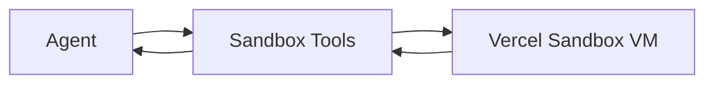

## Status

Accepted — 2026-01-30.

## Description

Run untrusted code and heavy analysis tasks in isolated Sandbox VMs.

## Context

Some steps require code execution (e.g., data analysis, parsing weird formats, validating generated artifacts). Running arbitrary code in server functions is unsafe. Vercel Sandbox provides isolated execution environments with time and resource controls, and AI SDK tools reduce custom implementation.

## Decision Drivers

- Security isolation
- Deterministic execution
- Tooling leverage
- Works in serverless workflows

## Alternatives

- A: Vercel Sandbox + AI SDK tools — Pros: safe isolation; managed. Cons: cost per run.
- B: Local-only execution — Pros: no cloud cost. Cons: not available from phone/laptop.
- C: Self-host containers — Pros: control. Cons: heavy ops for solo user.

### Decision Framework

| Criterion | Weight | Score | Weighted |
| --- | --- | --- | --- |
| Solution leverage | 0.35 | 9.2 | 3.22 |
| Application value | 0.30 | 9.3 | 2.79 |
| Maintenance & cognitive load | 0.25 | 9.0 | 2.25 |
| Architectural adaptability | 0.10 | 9.2 | 0.92 |

**Total:** 9.18 / 10.0

## Decision

We will implement “Code Mode” using **Vercel Sandbox**, exposing `bash-tool`, `code-execution`, and `ctx-zip` via AI SDK tools with strict budgets and allowlists.

## Constraints

- Never execute user-provided code outside Sandbox.
- Enforce timeout and resource limits.
- Restrict filesystem access and network egress as supported.
- Log all executed commands and outputs.

## High-Level Architecture

## Related Requirements

### Functional Requirements

- **FR-018:** sandbox code execution.

### Non-Functional Requirements

- **NFR-001:** isolation; no server compromise.
- **NFR-004:** log execution.

### Performance Requirements

- **PR-004:** run steps durable + retryable.

### Integration Requirements

- **IR-009:** use Sandbox.

## Design

### Architecture Overview

- `src/lib/sandbox/client.ts`: Sandbox session wrapper.
- Tool adapters expose high-level operations to agents.

### Implementation Details

- Default deny: only allow predefined commands.
- Provide `ctx-zip` to compress context artifacts deterministically.
- Persist execution logs in `run_steps`.

## Testing

- Contract: sandbox tool cannot access server env vars.
- Integration: safe command executes and output captured.
- Regression: timeouts enforced.

## Implementation Notes

- Prefer using Sandbox for CPU-bound transformations and parsing edge cases.

## Consequences

### Positive Outcomes

- Strong isolation model
- Enables reliable code-based validation

### Negative Consequences / Trade-offs

- Sandbox runtime costs
- Need strict allowlists

### Ongoing Maintenance & Considerations

- Review allowlists periodically
- Monitor sandbox usage quotas

### Dependencies

- **Added**: @vercel/sandbox, bash-tool, code-execution, ctx-zip
- **Removed**: []

## Changelog

- **0.1 (2026-01-29)**: Initial version.
- **0.2 (2026-01-30)**: Updated for current repo baseline (Bun, `src/` layout, CI).
