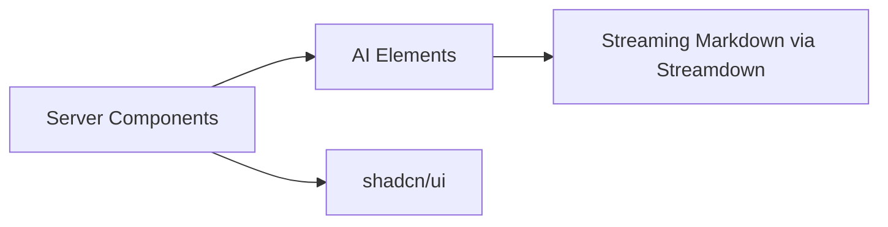

## Status

Accepted — 2026-01-30.
Implemented — 2026-02-05.

## Description

Use AI Elements for AI chat/streaming components and shadcn/ui for the rest of the UI.

See [SPEC-0021](../spec/SPEC-0021-full-stack-finalization-fluid-compute-neon-upstash-ai-elements.md)
for the cross-cutting “finalization” plan that specifies the workspace
information architecture and the API contracts required by the UI.

See [SPEC-0023](../spec/SPEC-0023-ai-elements-workspace-ui-and-interaction-model.md)
for the UI information architecture, component-vendoring plan, and interaction
model (chat/runs/search/uploads).

## Context

Building chat and streaming UI primitives from scratch is slow and error-prone. AI Elements provides ready-made components designed for AI SDK message parts. Streamdown improves streaming markdown rendering. shadcn/ui provides accessible UI components aligned with Tailwind v4.

## Decision Drivers

- Fast, robust AI UX
- Accessibility
- Maintainability
- Ecosystem alignment
- Minimal custom UI code

## Alternatives

- A: AI Elements + shadcn/ui — Pros: best alignment with AI SDK. Cons: evolving libs.
- B: Build custom components — Pros: control. Cons: high time cost and bugs.
- C: Other UI kits — Pros: mature. Cons: mismatched styling and patterns.

### Decision Framework

| Criterion | Weight | Score | Weighted |
| --- | --- | --- | --- |
| Solution leverage | 0.35 | 9.4 | 3.29 |
| Application value | 0.30 | 9.4 | 2.82 |
| Maintenance & cognitive load | 0.25 | 9.1 | 2.27 |
| Architectural adaptability | 0.10 | 9.2 | 0.92 |

**Total:** 9.30 / 10.0

## Decision

We will build UI with **TailwindCSS v4** and **shadcn/ui**, using **AI Elements** + **Streamdown** for chat and streaming content.

## Constraints

- Keep most components as Server Components.
- Use Client Components only when interactivity is required.
- Avoid manual memoization (React Compiler).
- Ensure keyboard accessibility.

## High-Level Architecture

## Related Requirements

### Functional Requirements

- **FR-008:** streaming chat UI.
- **FR-015:** render artifacts markdown.

### Non-Functional Requirements

- **NFR-008:** accessibility.
- **NFR-003:** maintainability.

### Performance Requirements

- **PR-001:** streaming start latency target.

### Integration Requirements

- **IR-010:** bun toolchain supports UI dependencies.

## Design

### Architecture Overview

- Use route groups: `(auth)` and `(app)`.
- Use AI Elements chat primitives once installed.

### Implementation Details

- Keep UI state in minimal client wrappers.
- Persist state server-side; avoid local storage for canonical state.

## Testing

- Component tests via Vitest + jsdom.
- E2E via Playwright for critical flows.

## Implementation Notes

- Install via Bun and keep versions aligned with AI SDK v6.

## Consequences

### Positive Outcomes

- Fast to implement high-quality AI UI
- Accessible components

### Negative Consequences / Trade-offs

- Need to track rapid library evolution

### Ongoing Maintenance & Considerations

- Regularly review AI Elements and shadcn updates

### Dependencies

- **Added**: @vercel/ai-elements, streamdown, shadcn/ui

## Changelog

- **0.1 (2026-01-29)**: Initial version.
- **0.2 (2026-01-30)**: Updated for current repo baseline (Bun, `src/` layout, CI).
- **0.3 (2026-02-03)**: Linked to SPEC-0021 as the cross-cutting finalization spec; added SPEC-0023 reference for UI/interaction model.
