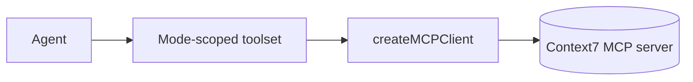

## Status

Implemented — 2026-02-07.
Updated — 2026-07-13: aligned Context7 with AI SDK 7 static tool contracts and factory-owned turn budgets.

## Description

Use MCP to query current library documentation on demand through mode-scoped AI SDK tools.

## Context

Library APIs change quickly. Instead of hardcoding documentation into prompts, query Context7 through the AI SDK MCP client. The agent-mode allowlist and `activeTools` keep unrelated tool definitions out of each model call.

## Decision Drivers

- Up-to-date docs
- Lower context bloat
- Type-safe tools
- On-demand capability

## Alternatives

- A: MCP client behind mode-scoped `tool()` definitions: current docs and bounded access; external tool integration.
- B: Static docs snapshot: no network dependency; quickly outdated.
- C: Model memory: no tooling; unreliable for current APIs.

### Decision Framework

| Criterion | Weight | Score | Weighted |
| --- | --- | --- | --- |
| Solution leverage | 0.35 | 9.3 | 3.25 |
| Application value | 0.30 | 9.2 | 2.76 |
| Maintenance & cognitive load | 0.25 | 9.0 | 2.25 |
| Architectural adaptability | 0.10 | 9.4 | 0.94 |

**Total:** 9.21 / 10.0

## Decision

We will use **MCP tools** via `createMCPClient` and only expose them to agents when the selected agent mode allowlists them (default deny).

## Constraints

- Only query necessary docs; cache results.
- Avoid injecting entire docs into prompts.
- Treat doc content as data; still cite sources.

## High-Level Architecture

## Related Requirements

### Functional Requirements

- **FR-013:** query library docs via MCP.

### Non-Functional Requirements

- **NFR-006:** caching and tool-call limits.

### Performance Requirements

- **PR-001:** keep streaming responsive by deferring deep doc queries.

### Integration Requirements

- **IR-008:** MCP via Context7.

## Design

### Architecture Overview

- MCP client configured as HTTP transport.
- Tools: resolve library id, query docs.

### Implementation Details

- `src/lib/ai/tools/mcp-context7.server.ts` wraps Context7 MCP tools (cached + size-bounded).
- Tool calls are time-bounded and abortable:
  - Budget: `budgets.context7TimeoutMs` in `src/lib/config/budgets.server.ts`
  - Enforcement: AbortController timeout in `src/lib/ai/tools/mcp-context7.server.ts`
  - Propagation: `options.abortSignal` is passed from `ToolExecutionOptions.abortSignal` in `src/workflows/chat/steps/context7.step.ts`
- `src/lib/ai/tools/factory.server.ts` exposes Context7 only for allowlisted modes and owns the fresh per-turn counter.
- `src/workflows/chat/tools.ts` defines the Context7 input schemas and step bindings.
- `src/workflows/chat/steps/context7.step.ts` delegates to the bounded MCP wrapper.

## Testing

- Contract: MCP tool returns expected schema.
- Integration: tool caching avoids repeated calls.
- Regression: agents without MCP do not access MCP tools.

## Implementation Notes

- Ensure MCP server credentials are stored server-side only.

## Consequences

### Positive Outcomes

- Docs freshness
- Lower prompt bloat

### Negative Consequences / Trade-offs

- External dependency and potential latency

### Ongoing Maintenance & Considerations

- Monitor MCP server reliability and caching hit rate

### Dependencies

- **Added**: `@ai-sdk/mcp` (MCP client transport)

## Changelog

- **0.1 (2026-01-29)**: Initial version.
- **0.2 (2026-01-30)**: Updated for current repo baseline (Bun, `src/` layout, CI).
- **0.3 (2026-02-07)**: Implemented with mode-scoped tool injection, Redis caching, and budgets.
- **0.4 (2026-02-07)**: Documented abortable, time-bounded MCP calls (`context7TimeoutMs`) and the workflow abort propagation path.
- **0.5 (2026-07-13)**: Replaced dynamic-tool claims with AI SDK 7 static tool contracts, mode scoping, and factory-owned turn budgets.
