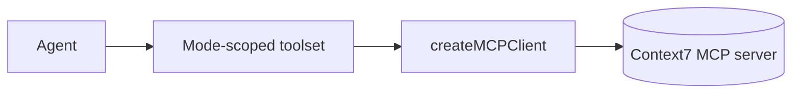

## Status

Implemented — 2026-02-07.

## Description

Use MCP to query up-to-date library documentation on demand, injected as dynamic tools.

## Context

Library APIs change quickly. Instead of hardcoding doc content into prompts, we can query official library docs via Context7 MCP tools. Dynamic tool injection prevents bloating the agent context window.

## Decision Drivers

- Up-to-date docs
- Lower context bloat
- Type-safe tools
- On-demand capability

## Alternatives

- A: MCP + dynamicTool — Pros: fresh docs; minimal context. Cons: tool integration.
- B: Static docs snapshot — Pros: simple. Cons: quickly outdated.
- C: Rely on model memory — Pros: no tooling. Cons: unreliable.

### Decision Framework

| Criterion | Weight | Score | Weighted |
| --- | --- | --- | --- |
| Solution leverage | 0.35 | 9.3 | 3.25 |
| Application value | 0.30 | 9.2 | 2.76 |
| Maintenance & cognitive load | 0.25 | 9.0 | 2.25 |
| Architectural adaptability | 0.10 | 9.4 | 0.94 |

**Total:** 9.21 / 10.0

## Decision

We will use **MCP tools** via `createMCPClient` and only expose them to agents when the selected agent mode allowlists them (default deny).

## Constraints

- Only query necessary docs; cache results.
- Avoid injecting entire docs into prompts.
- Treat doc content as data; still cite sources.

## High-Level Architecture

## Related Requirements

### Functional Requirements

- **FR-013:** query library docs via MCP.

### Non-Functional Requirements

- **NFR-006:** caching and tool-call limits.

### Performance Requirements

- **PR-001:** keep streaming responsive by deferring deep doc queries.

### Integration Requirements

- **IR-008:** MCP via Context7.

## Design

### Architecture Overview

- MCP client configured as HTTP transport.
- Tools: resolve library id, query docs.

### Implementation Details

- `src/lib/ai/tools/mcp-context7.server.ts` wraps Context7 MCP tools (cached + size-bounded).
- `src/lib/ai/tools/factory.server.ts` injects Context7 tools only for allowlisted modes.
- `src/workflows/chat/steps/context7.step.ts` enforces per-turn budgets for Context7 calls.

## Testing

- Contract: MCP tool returns expected schema.
- Integration: tool caching avoids repeated calls.
- Regression: agents without MCP do not access MCP tools.

## Implementation Notes

- Ensure MCP server credentials are stored server-side only.

## Consequences

### Positive Outcomes

- Docs freshness
- Lower prompt bloat

### Negative Consequences / Trade-offs

- External dependency and potential latency

### Ongoing Maintenance & Considerations

- Monitor MCP server reliability and caching hit rate

### Dependencies

- **Added**: `@ai-sdk/mcp` (MCP client transport)

## Changelog

- **0.1 (2026-01-29)**: Initial version.
- **0.2 (2026-01-30)**: Updated for current repo baseline (Bun, `src/` layout, CI).
- **0.3 (2026-02-07)**: Implemented with mode-scoped tool injection, Redis caching, and budgets.
