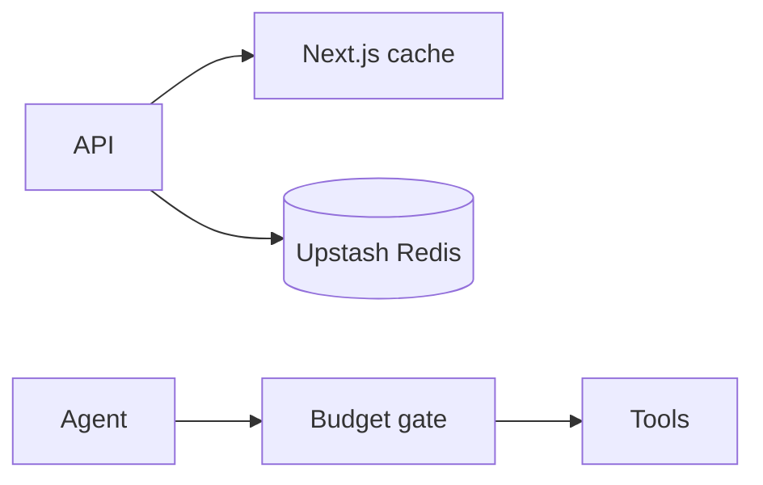

## Status

Implemented — 2026-02-06.

## Description

Use layered caching and guardrails to reduce cost and improve latency.

See [SPEC-0021](../spec/SPEC-0021-full-stack-finalization-fluid-compute-neon-upstash-ai-elements.md)
for the cross-cutting “finalization” plan that applies caching and budgets to
ingestion, retrieval, chat, and durable runs.

## Context

Research and agent workflows can be expensive. We need aggressive but safe caching and strict budgets to keep costs predictable for a single-user deployment.

## Decision Drivers

- Cost predictability
- Latency reduction
- Avoid duplicate tool calls
- Prevent runaway agent loops

## Alternatives

- A: Next caching + Redis + budgets — Pros: strong control. Cons: more config.
- B: No caching — Pros: simplest. Cons: expensive and slow.
- C: Only Next caching — Pros: built-in. Cons: doesn't cover external tools well.

### Decision Framework

| Criterion | Weight | Score | Weighted |
| --- | --- | --- | --- |
| Solution leverage | 0.35 | 9.2 | 3.22 |
| Application value | 0.30 | 9.4 | 2.82 |
| Maintenance & cognitive load | 0.25 | 9.1 | 2.27 |
| Architectural adaptability | 0.10 | 9.2 | 0.92 |

**Total:** 9.23 / 10.0

## Decision

We will use **Next.js caching** for deterministic server loaders and **Upstash Redis** for tool result caching, plus hard budgets on agent steps and tool calls.

## Constraints

- Do not cache secrets.
- Cache must be scoped by project and tool parameters.
- Budget checks must run before expensive steps.

## High-Level Architecture

## Related Requirements

### Functional Requirements

- **FR-012:** research w/ caching.
- **FR-010:** durable runs w/ budgets.

### Non-Functional Requirements

- **NFR-006:** cost controls.
- **NFR-004:** persist usage.

### Performance Requirements

- **PR-002:** warm retrieval latency target.

### Integration Requirements

- **IR-003:** Upstash Redis + Ratelimit.

## Design

### Architecture Overview

- `use cache` for stable DB reads and model catalog reads.
- Redis for web fetch caching, MCP caching, and tool rate limiting.
- Tag-based invalidation via `revalidateTag(..., "max")` for project creation,
  uploads/ingestion completion, and artifact creation.

### Implementation Details

- Define budgets in `src/lib/config/budgets.server.ts`.
- Persist per-step usage, enforce max tokens and tool calls.
- Standardize cache tags in `src/lib/cache/tags.ts` and apply to server loaders
  using `'use cache'` + `cacheTag`.
- Apply server-side search rate limiting with Upstash Ratelimit in
  `src/lib/upstash/ratelimit.server.ts` and enforce from
  `src/app/api/search/route.ts`.
- Enforce ownership-scoped search queries (`projects.owner_user_id`) to avoid
  cross-project/cross-user leakage.

## Testing

- Unit: budget logic.
- Integration: repeated runs hit cache.
- Regression: budgets prevent unbounded loops.

## Implementation Notes

- Cache invalidation is project-scoped: on new upload or artifact update, invalidate relevant keys.
- Next.js cache constraints:
  - Cached scopes (`'use cache'`) must not call runtime APIs like `cookies()`, `headers()`, or `searchParams()`; read runtime data outside the cached scope and pass it in.
  - Cache tag limits: each tag string must be <= 256 characters; each cache entry may have at most 128 tags.

## Consequences

### Positive Outcomes

- Lower cost
- Faster repeated queries
- Better stability

### Negative Consequences / Trade-offs

- Cache invalidation complexity

### Ongoing Maintenance & Considerations

- Review cache hit rate and adjust TTLs
- Audit budget thresholds periodically

### Dependencies

- **Added**: @upstash/redis, @upstash/ratelimit

## Changelog

- **0.1 (2026-01-29)**: Initial version.
- **0.2 (2026-01-30)**: Updated for current repo baseline (Bun, `src/` layout, CI).
- **0.3 (2026-02-03)**: Linked to SPEC-0021 as the cross-cutting finalization spec.
- **0.4 (2026-02-06)**: Marked implemented; added Cache Components/tag invalidation implementation details and concrete file references.
- **0.5 (2026-02-06)**: Added ownership-scoped search + Upstash Ratelimit implementation details for `/api/search`.
