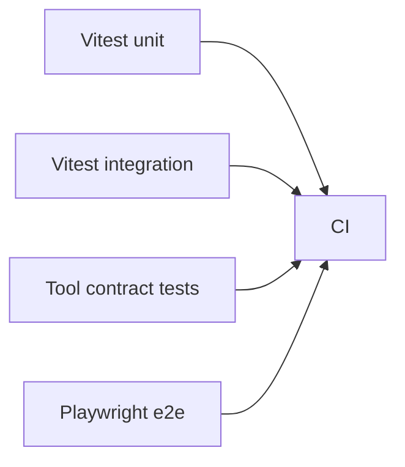

## Status

Accepted — 2026-01-30.
Implemented — 2026-02-05.

## Description

Use Vitest for unit/integration tests now; add Playwright for E2E once core UI flows exist.

## Context

The current repo includes Vitest and a CI job for tests. UI and run workflows will become complex and require end-to-end coverage. Contract tests are needed to ensure external tool adapters return stable shapes (Exa/Firecrawl/MCP/Sandbox).

## Decision Drivers

- Fast feedback loop
- Confidence in agent tools
- CI stability
- Agent-first development

## Alternatives

- A: Vitest + Playwright — Pros: strong coverage. Cons: more setup.
- B: Vitest only — Pros: simple. Cons: misses UI regressions.
- C: Playwright only — Pros: real flows. Cons: slow feedback for logic.

### Decision Framework

| Criterion | Weight | Score | Weighted |
| --- | --- | --- | --- |
| Solution leverage | 0.35 | 9.1 | 3.18 |
| Application value | 0.30 | 9.2 | 2.76 |
| Maintenance & cognitive load | 0.25 | 9.0 | 2.25 |
| Architectural adaptability | 0.10 | 9.2 | 0.92 |

**Total:** 9.11 / 10.0

## Decision

We will use **Vitest** for unit and integration tests immediately (current repo), and add **Playwright** for E2E tests when the login/project/upload/run flows are implemented. Tool adapters will have contract tests.

## Constraints

- Tests must run under Bun.
- Type generation (`next typegen`) must happen before typechecked tests.
- E2E tests must not require external paid APIs by default (use mocks).

## High-Level Architecture

## Related Requirements

### Functional Requirements

- **FR-008:** chat correctness.
- **FR-010:** durable runs correctness.

### Non-Functional Requirements

- **NFR-010:** CI quality gates.
- **NFR-004:** observability for failures.

### Performance Requirements

- **PR-006:** CI time target.

### Integration Requirements

- **IR-010:** Bun toolchain.

## Design

### Architecture Overview

- Tests colocated under `src/**` or `tests/**`.
- Use request-level integration tests for route handlers.

### Implementation Details

- Mock AI Gateway and external tools for deterministic tests.
- Run `bun --bun next typegen` before typechecked test steps.

## Testing

- CI already runs `bun run test`.
- Add Playwright workflow when UI is implemented.
- Contract tests validate tool schemas.

## Implementation Notes

- Keep slow E2E tests behind a separate workflow if needed; do not slow every PR.

## Consequences

### Positive Outcomes

- Fast iteration and confidence
- Catches tool integration regressions

### Negative Consequences / Trade-offs

- Additional maintenance when Playwright added

### Ongoing Maintenance & Considerations

- Maintain stable mocks for external tools
- Watch flakiness in E2E

### Dependencies

- **Added**: vitest (already), playwright (later)

## Changelog

- **0.1 (2026-01-29)**: Initial version.
- **0.2 (2026-01-30)**: Updated for current repo baseline (Bun, `src/` layout, CI).
