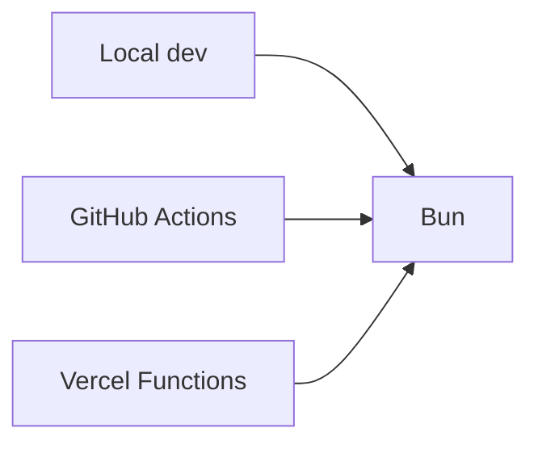

## Status

Accepted — 2026-01-30.

## Description

Standardize on Bun for local dev, CI, and Vercel Functions runtime.

## Context

The bootstrapped repository already uses Bun in scripts and CI setup, and Vercel Functions can be configured to run on Bun by setting `bunVersion` in `vercel.json`. Bun can reduce CPU-bound latency and simplifies the toolchain by replacing Node+pnpm with one runtime+PM.

## Decision Drivers

- Performance
- Toolchain simplicity
- Vercel alignment
- Deterministic installs

## Alternatives

- A: Bun everywhere — Pros: unified toolchain; perf. Cons: runtime beta on Vercel.
- B: Node + pnpm — Pros: mature. Cons: slower and more moving parts.
- C: Node + npm — Pros: simplest default. Cons: slower installs; less DX.

### Decision Framework

| Criterion | Weight | Score | Weighted |
| --- | --- | --- | --- |
| Solution leverage | 0.35 | 9.5 | 3.32 |
| Application value | 0.30 | 9.1 | 2.73 |
| Maintenance & cognitive load | 0.25 | 9.4 | 2.35 |
| Architectural adaptability | 0.10 | 9.0 | 0.90 |

**Total:** 9.30 / 10.0

## Decision

We will use **Bun** for all installs and scripts, and configure Vercel Functions to run on Bun (`bunVersion: "1.x"`). CI uses Bun and installs with `--frozen-lockfile`.

## Constraints

- Vercel Bun runtime requires `bunVersion: "1.x"`.
- CI must be deterministic (frozen lockfile).
- Lifecycle scripts must be allowlisted via `trustedDependencies`.

## High-Level Architecture

## Related Requirements

### Functional Requirements

- **FR-021:** model catalog script runs with Bun.

### Non-Functional Requirements

- **NFR-010:** Bun-only quality gates.
- **NFR-009:** secure lifecycle script posture.

### Performance Requirements

- **PR-006:** CI time improvements from Bun installs.

### Integration Requirements

- **IR-010:** Bun required.

## Design

### Architecture Overview

- Commit Bun lockfile and enforce frozen installs.
- Ensure Next scripts run under Bun (`bun --bun next ...`).

### Implementation Details

- `vercel.json` already sets `bunVersion: "1.x"`.
- CI composite action installs Bun and runs `bun install --frozen-lockfile`.
- Maintain `trustedDependencies` allowlist for packages requiring scripts.

## Testing

- CI verifies `bun run build` and `bun run test`.
- Add a smoke deployment check to verify Bun runtime selection in Vercel logs.

## Implementation Notes

- Keep rollback documented: remove `bunVersion` to return to Node runtime on Vercel.

## Consequences

### Positive Outcomes

- Unified toolchain
- Potential latency improvement
- Simpler scripts

### Negative Consequences / Trade-offs

- Bun runtime on Vercel is beta; occasional edge cases possible

### Ongoing Maintenance & Considerations

- Track Bun/Vercel runtime updates
- Audit trustedDependencies on dependency changes

### Dependencies

- **Added**: bun (toolchain)
- **Removed**: pnpm, node-only assumptions

## Changelog

- **0.1 (2026-01-29)**: Initial version.
- **0.2 (2026-01-30)**: Updated for current repo baseline (Bun, `src/` layout, CI).
