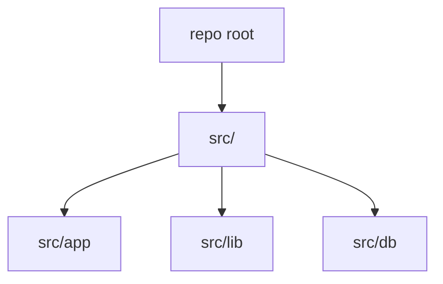

## Status

Accepted — 2026-01-30.

## Description

Standardize repository code under `src/` and use `@/*` import aliases for readability.

## Context

The bootstrapped repository already uses a `src/` directory and a TS path alias mapping `@/*` to `src/*`. Keeping this convention improves readability and reduces brittle relative imports, especially in a large agentic system with many modules.

## Decision Drivers

- Clarity
- Reduced import noise
- Scalability within single repo
- Alignment with current repo

## Alternatives

- A: Use `src/` + `@/*` alias — Pros: cleaner imports. Cons: requires TS config consistency.
- B: No `src/` folder — Pros: default. Cons: mixing app and tooling files at root.
- C: Multiple aliases per domain — Pros: very short imports. Cons: more config churn.

### Decision Framework

| Criterion | Weight | Score | Weighted |
| --- | --- | --- | --- |
| Solution leverage | 0.35 | 9.3 | 3.25 |
| Application value | 0.30 | 9.1 | 2.73 |
| Maintenance & cognitive load | 0.25 | 9.4 | 2.35 |
| Architectural adaptability | 0.10 | 9.1 | 0.91 |

**Total:** 9.24 / 10.0

## Decision

We will keep all application code under `src/` and standardize imports using the `@/*` alias as already configured in `tsconfig.json`.

## Constraints

- Any new tool scripts outside `src/` must not import app runtime modules.
- Enforce path alias usage in new code to reduce `../../` imports.

## High-Level Architecture

## Related Requirements

### Functional Requirements

- **FR-014:** consistent file-level contracts for generated artifacts.

### Non-Functional Requirements

- **NFR-003:** maintainability via consistent structure.

### Performance Requirements

- None

### Integration Requirements

- **IR-010:** Bun scripts resolve TS paths consistently.

## Design

### Architecture Overview

- `src/app`: UI routes and route handlers.
- `src/lib`: domain modules.
- `src/db`: schema and migrations.

### Implementation Details

- Keep `tsconfig.json` `paths` in sync.
- Avoid introducing additional aliases unless necessary.

## Testing

- Lint rule can be added later to prevent deep relative imports.

## Implementation Notes

- Ensure tooling (Vitest/Vite) respects TS paths (already via vite-tsconfig-paths).

## Consequences

### Positive Outcomes

- Cleaner imports
- Scales as repo grows

### Negative Consequences / Trade-offs

- Requires tool config alignment

### Ongoing Maintenance & Considerations

- Update tooling configs if TS path alias changes

### Dependencies

- None

## Changelog

- **0.1 (2026-01-29)**: Initial version.
- **0.2 (2026-01-30)**: Updated for current repo baseline (Bun, `src/` layout, CI).
- **0.3 (2026-02-05)**: Implemented.
