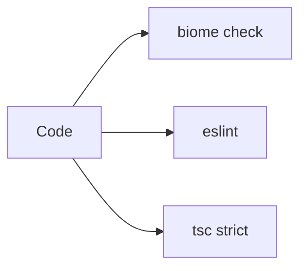

## Status

Accepted — 2026-01-30.

## Description

Enforce formatting, linting, and documentation requirements with Biome + ESLint, and strict TypeScript settings.

## Context

Agent-driven development is faster when the repo enforces deterministic formatting and catches issues early. The bootstrapped repo already uses Biome for formatting/linting and ESLint for JSDoc/TSDoc enforcement. TypeScript is strict and forbids `any`.

## Decision Drivers

- Consistency
- Fast feedback
- Agent-friendly constraints
- Avoid `any` and undocumented APIs

## Alternatives

- A: Biome + ESLint (doc rules) — Pros: fast, consistent. Cons: two tools.
- B: ESLint + Prettier — Pros: common. Cons: slower and more config.
- C: Biome only — Pros: simplest. Cons: weaker TSDoc enforcement.

### Decision Framework

| Criterion | Weight | Score | Weighted |
| --- | --- | --- | --- |
| Solution leverage | 0.35 | 9.4 | 3.29 |
| Application value | 0.30 | 9.1 | 2.73 |
| Maintenance & cognitive load | 0.25 | 9.2 | 2.30 |
| Architectural adaptability | 0.10 | 9.1 | 0.91 |

**Total:** 9.23 / 10.0

## Decision

We will keep **Biome** as the primary formatter/linter, and use **ESLint** to enforce JSDoc policy and TSDoc syntax on exported APIs, matching the current repo configuration.

## Constraints

- Line width 80.
- No explicit `any`.
- Exported APIs require docs.
- Tooling must run under Bun.

## High-Level Architecture

## Related Requirements

### Functional Requirements

- None

### Non-Functional Requirements

- **NFR-010:** CI quality gates.
- **NFR-011:** agent-first DX.

### Performance Requirements

- **PR-006:** CI completes quickly (Biome is fast).

### Integration Requirements

- **IR-010:** Bun toolchain.

## Design

### Architecture Overview

- `biome.json` defines formatting, linting, and 80-char line width.
- `eslint.config.js` uses flat config and enforces JSDoc/TSDoc.
- `tsconfig.json` is strict, `moduleResolution: Bundler`.

### Implementation Details

- Keep ESLint rules focused to avoid overlap with Biome.
- Use `bun run lint` to run both tools.

## Testing

- CI already runs lint and typecheck.
- Add lint/test targets for newly added packages as needed.

## Implementation Notes

- Avoid adding Prettier to reduce toolchain complexity.

## Consequences

### Positive Outcomes

- Consistent codebase
- Fewer regressions
- Agent-friendly invariants

### Negative Consequences / Trade-offs

- Two linter tools to maintain

### Ongoing Maintenance & Considerations

- Keep rules minimal and update when upstream changes

### Dependencies

- **Added**: @biomejs/biome, eslint, eslint-plugin-jsdoc, eslint-plugin-tsdoc
- **Removed**: prettier (not used)

## Changelog

- **0.1 (2026-01-29)**: Initial version.
- **0.2 (2026-01-30)**: Updated for current repo baseline (Bun, `src/` layout, CI).
