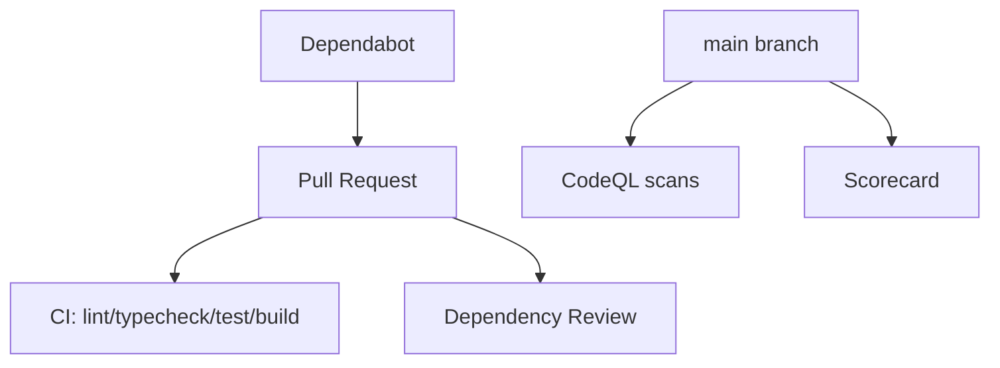

## Status

Accepted — 2026-01-30.

## Description

Keep CI and security scanning enabled by default to reduce supply-chain and code risks.

## Context

Even single-user tools can leak secrets or execute untrusted inputs. The repo is already configured with CI and multiple security workflows. This ADR documents them as intentional architecture choices.

## Decision Drivers

- Reduce supply chain risk
- Catch vulnerabilities early
- Keep maintainability high
- Minimal manual security effort

## Alternatives

- A: Enable scanning workflows — Pros: strong security defaults. Cons: some CI noise.
- B: CI only (no security scanning) — Pros: less noise. Cons: higher risk.
- C: Manual audits only — Pros: no CI. Cons: unrealistic and error-prone.

### Decision Framework

| Criterion | Weight | Score | Weighted |
| --- | --- | --- | --- |
| Solution leverage | 0.35 | 9.2 | 3.22 |
| Application value | 0.30 | 9.1 | 2.73 |
| Maintenance & cognitive load | 0.25 | 9.1 | 2.27 |
| Architectural adaptability | 0.10 | 9.2 | 0.92 |

**Total:** 9.14 / 10.0

## Decision

We will keep **CI** and **supply chain security workflows** enabled, including CodeQL, Dependency Review, Scorecard, and Dependabot (Bun ecosystem).

## Constraints

- Workflows must not require paid services.
- CI must remain under time budgets.
- Dependabot PR volume should be manageable (group minor/patch).

## High-Level Architecture

## Related Requirements

### Functional Requirements

- None

### Non-Functional Requirements

- **NFR-009:** supply chain security.
- **NFR-010:** CI quality gates.

### Performance Requirements

- **PR-006:** CI completion target.

### Integration Requirements

- **IR-010:** Bun ecosystem dependency management.

## Design

### Architecture Overview

- `.github/workflows/ci.yml`: primary checks.
- `.github/workflows/codeql.yml`: code scanning.
- `.github/workflows/dependency-review.yml`: PR dependency diffs.
- `.github/workflows/scorecard.yml`: security posture scoring.
- `.github/dependabot.yml`: dependency updates.

### Implementation Details

- Group minor/patch updates weekly.
- Keep workflows minimal and stable.

## Testing

- Ensure workflows run on PR and main.
- Validate CodeQL queries and config file.

## Implementation Notes

- Consider adding secret scanning alerts if repository becomes public.

## Consequences

### Positive Outcomes

- Early vulnerability detection
- Reduced manual maintenance burden

### Negative Consequences / Trade-offs

- Occasional workflow noise/false positives

### Ongoing Maintenance & Considerations

- Triage security alerts promptly
- Keep dependency update cadence manageable

### Dependencies

- **Added**: []
- **Removed**: []

## Changelog

- **0.1 (2026-01-29)**: Initial version.
- **0.2 (2026-01-30)**: Updated for current repo baseline (Bun, `src/` layout, CI).
