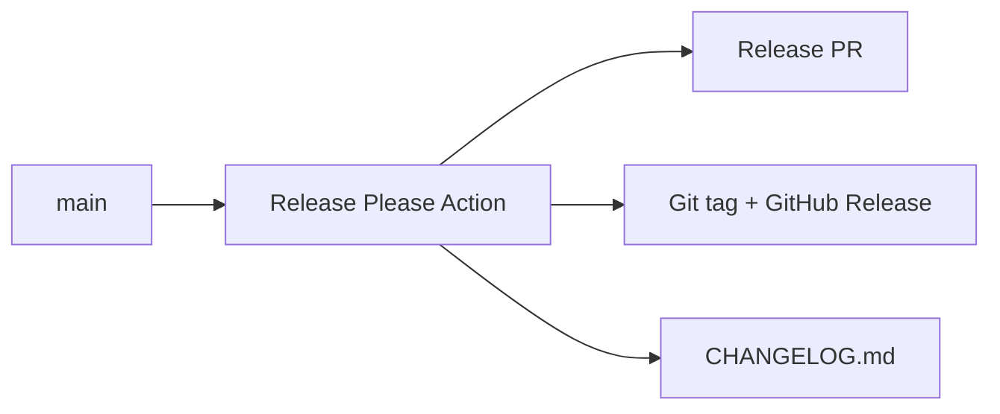

## Status

Accepted — 2026-01-30.

## Description

Automate versioning and changelog updates via Release Please.

## Context

Manual changelog updates and version bumps are error-prone. The repo already includes Release Please configuration and workflow. This ADR makes it a formal requirement.

## Decision Drivers

- Consistent releases
- Low manual effort
- Clear changelog history

## Alternatives

- A: Release Please — Pros: automated, conventional commits. Cons: needs discipline.
- B: Manual releases — Pros: full control. Cons: error-prone and time-consuming.
- C: Changesets — Pros: popular. Cons: more workflow overhead for this repo.

### Decision Framework

| Criterion | Weight | Score | Weighted |
| --- | --- | --- | --- |
| Solution leverage | 0.35 | 9.2 | 3.22 |
| Application value | 0.30 | 9.0 | 2.70 |
| Maintenance & cognitive load | 0.25 | 9.2 | 2.30 |
| Architectural adaptability | 0.10 | 9.1 | 0.91 |

**Total:** 9.13 / 10.0

## Decision

We will use **Release Please** to manage semver releases and update `CHANGELOG.md`, enforcing **Conventional Commits** in PR merges.

## Constraints

- Pre-1.0 bump strategy configured (`bump-minor-pre-major`).
- Releases occur from `main` only.
- Changelog is the canonical release history.

## High-Level Architecture

## Related Requirements

### Functional Requirements

- None

### Non-Functional Requirements

- **NFR-010:** CI quality gates before release.

### Performance Requirements

- None

### Integration Requirements

- **IR-010:** Bun toolchain does not impact JS release automation.

## Design

### Architecture Overview

- Workflow: `.github/workflows/release-please.yml`.
- Config: `release-please-config.json`, `.release-please-manifest.json`.

### Implementation Details

- Use conventional commit prefixes (`feat`, `fix`, `chore`, etc.).
- Breaking changes before 1.0 bump minor.

## Testing

- Ensure CI passes before merging release PRs.

## Implementation Notes

- Release Please uses a `node` release type; this is fine for Bun-based projects.

## Consequences

### Positive Outcomes

- Automatic changelog and version bumps
- Clear history

### Negative Consequences / Trade-offs

- Requires disciplined commit messages

### Ongoing Maintenance & Considerations

- Review release PRs for correctness
- Adjust config when versioning policy changes

### Dependencies

- None

## Changelog

- **0.1 (2026-01-29)**: Initial version.
- **0.2 (2026-01-30)**: Updated for current repo baseline (Bun, `src/` layout, CI).
