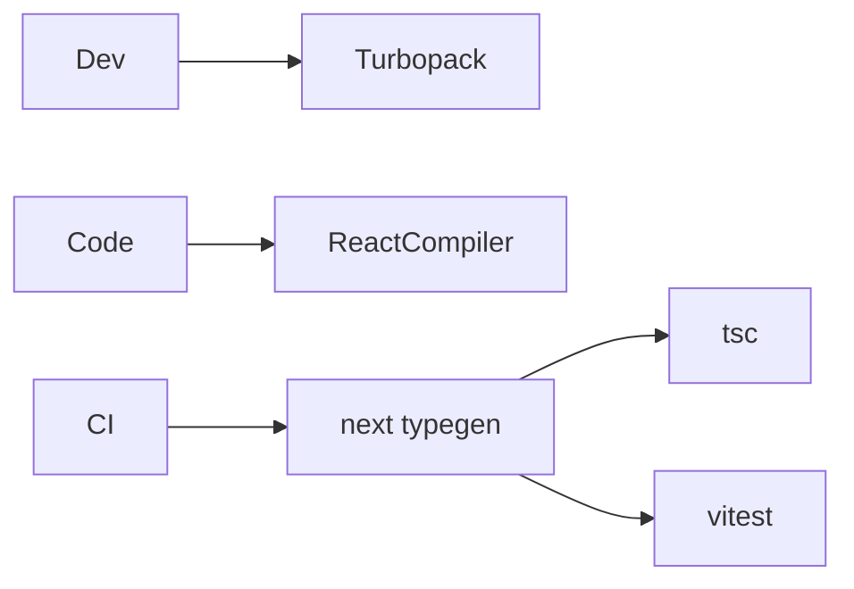

## Status

Accepted — 2026-01-30.

## Description

Enable React Compiler and Turbopack, and use `next typegen` as a build-independent typing gate.

## Context

The bootstrapped repo already enables `reactCompiler: true` and a Turbopack root in `next.config.ts`. It also runs `next typegen` as part of `test` and `typecheck` scripts. This ADR makes these choices explicit so future work does not regress.

## Decision Drivers

- Faster dev builds
- Avoid manual memoization
- Consistent typings
- Agent-friendly rules

## Alternatives

- A: React Compiler + Turbopack + typegen — Pros: fast dev, fewer perf footguns. Cons: some edge cases.
- B: Webpack + manual memoization — Pros: mature. Cons: more human effort and regressions.
- C: No typegen — Pros: simpler scripts. Cons: missing generated types and route typing issues.

### Decision Framework

| Criterion | Weight | Score | Weighted |
| --- | --- | --- | --- |
| Solution leverage | 0.35 | 9.1 | 3.18 |
| Application value | 0.30 | 9.1 | 2.73 |
| Maintenance & cognitive load | 0.25 | 9.2 | 2.30 |
| Architectural adaptability | 0.10 | 9.1 | 0.91 |

**Total:** 9.12 / 10.0

## Decision

We will keep **React Compiler** enabled, use **Turbopack** for dev/build where supported, and run `next typegen` in CI before typechecking/tests.

## Constraints

- Do not add manual memoization without explicit justification.
- CI must run `next typegen` for stable types.
- Keep `next.config.ts` minimal and aligned with Next 16.

## High-Level Architecture

## Related Requirements

### Functional Requirements

- None

### Non-Functional Requirements

- **NFR-011:** agent-first DX (no useMemo/useCallback).
- **NFR-010:** CI enforces typing gates.

### Performance Requirements

- **PR-006:** faster CI/dev builds.

### Integration Requirements

- **IR-010:** Bun scripts run Next tooling.

## Design

### Architecture Overview

- `next.config.ts`: `reactCompiler: true`, `turbopack.root` set.
- `package.json` scripts run `bun --bun next typegen`.

### Implementation Details

- Ensure Vitest runs after typegen.
- Keep React Compiler plugin versions aligned with Next/React versions.

## Testing

- CI already runs typegen before tests/typecheck.
- Add a regression test to fail on accidental `useMemo` usage if desired.

## Implementation Notes

- If Turbopack issues arise, document fallback to stable bundler in ops runbook.

## Consequences

### Positive Outcomes

- Better performance defaults
- Less manual optimization work

### Negative Consequences / Trade-offs

- Some tooling may evolve and require adjustments

### Ongoing Maintenance & Considerations

- Watch Next/React compiler release notes
- Update scripts when Next changes tooling

### Dependencies

- **Added**: babel-plugin-react-compiler (already present)
- **Removed**: []

## Changelog

- **0.1 (2026-01-29)**: Initial version.
- **0.2 (2026-01-30)**: Updated for current repo baseline (Bun, `src/` layout, CI).
