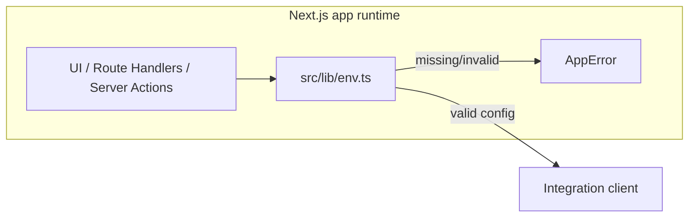

## Status

Implemented — 2026-01-30.  
Updated — 2026-02-01 (implementation/deploy automation integrations).

## Description

Centralize environment variable access behind a single typed module, and enforce
server-only secret handling.

All integrations are **feature-gated**: missing credentials disable a feature
cleanly, without leaking secrets or breaking unrelated parts of the app.

## Context

ai-agent-builder integrates several providers (DB, Upstash, QStash, AI Gateway,
Blob, Exa, Firecrawl, Sandbox, MCP). These integrations require secrets and
configuration, and incorrect configuration should fail clearly without breaking
optional features or leaking secrets to client bundles.

Implementation Runs add new integrations:

- GitHub (RepoOps)
- Vercel API (deployments + env var management)
- optional Neon API provisioning
- optional Upstash Developer API provisioning

## Decision Drivers

- Avoid secret exposure to client bundles
- Clear, typed configuration contracts (Zod v4)
- Feature-gated validation to keep optional features optional
- Consistent error behavior for Route Handlers and Server Actions
- Support optional automation integrations without forcing credentials

## Related Requirements

### Functional Requirements

- **FR-001:** Managed authentication via Neon Auth.
- **FR-023:** Start a durable Implementation Run (plan → code → verify → deploy).
- **FR-028:** Create/configure a deployment target and set environment variables.
- **FR-031:** Enforce approval gates for side-effectful operations.

### Non-Functional Requirements

- **NFR-001:** Protect server-only keys and secrets.
- **NFR-003:** Strict TypeScript and modular configuration contracts.
- **NFR-013:** Least privilege for provider credentials and gated unsafe tools.

### Performance Requirements

- **PR-004:** Runs complete despite client disconnects (feature gating avoids
  breaking unrelated paths).
- **PR-006:** CI completes within 10 minutes (p95) for typical PRs (avoid costly
  global env validation on import).

### Integration Requirements

- **IR-001:** Model/embedding calls through Vercel AI Gateway.
- **IR-002:** Relational store is Neon Postgres.
- **IR-004:** Durable runs via Upstash QStash.
- **IR-011:** Repo operations via GitHub.
- **IR-012:** Deployments and env var management via Vercel API/SDK.
- **IR-013:** Optional provisioning via Neon API.
- **IR-014:** Optional provisioning via Upstash Developer API.

## Alternatives

- A: Read `process.env` directly everywhere
  - Pros: minimal upfront work.
  - Cons: untyped, inconsistent errors, easy to leak secrets.
- B: Parse all env vars at module import time
  - Pros: fail-fast at startup.
  - Cons: optional features break builds/deploys; harder local iteration.

### Decision Framework

| Criterion | Weight | Score | Weighted |
| --- | --- | --- | --- |
| Solution leverage | 0.35 | 9.4 | 3.29 |
| Application value | 0.30 | 9.2 | 2.76 |
| Maintenance & cognitive load | 0.25 | 9.1 | 2.28 |
| Architectural adaptability | 0.10 | 9.2 | 0.92 |

**Total:** 9.25 / 10.0

## Decision

We will adopt **typed, feature-gated environment configuration contracts** to
address secret handling and optional integrations. This involves using
**Zod v4 schemas** behind a **server-only env boundary (`src/lib/env.ts`)**
configured with **per-integration feature gates** and **normalized errors**.

- `src/lib/env.ts` is the only place in `src/**` that reads `process.env`.
- `src/lib/env.ts` is server-only (`server-only`) and must not be imported from
  Client Components.
- Each integration validates its required variables only when accessed
  ("feature gates").
- Misconfiguration fails at runtime on first usage with an `AppError` and a
  clear message listing missing/invalid variables.

## Environment variable groups

### Required for core operation

- `DATABASE_URL`
- Neon Auth:
  - `NEON_AUTH_BASE_URL`
  - `NEON_AUTH_COOKIE_SECRET`
  - `NEON_AUTH_COOKIE_DOMAIN` (optional)
- App access control:
  - `AUTH_ACCESS_MODE` (optional; defaults to `restricted`)
  - `AUTH_ALLOWED_EMAILS` (required when restricted)

### Required for full feature set (research/spec phase)

- `AI_GATEWAY_API_KEY` (+ optional `AI_GATEWAY_BASE_URL`)
- `UPSTASH_REDIS_REST_URL`, `UPSTASH_REDIS_REST_TOKEN`
- `UPSTASH_VECTOR_REST_URL`, `UPSTASH_VECTOR_REST_TOKEN`
- `QSTASH_TOKEN`, `QSTASH_CURRENT_SIGNING_KEY`, `QSTASH_NEXT_SIGNING_KEY`
- `BLOB_READ_WRITE_TOKEN`
- `EXA_API_KEY`, `FIRECRAWL_API_KEY`, `CONTEXT7_API_KEY`

### Optional for implementation/deploy automation

- GitHub: `GITHUB_TOKEN` (fine-grained PAT recommended)
- GitHub webhooks (optional): `GITHUB_WEBHOOK_SECRET`
- Vercel API: `VERCEL_TOKEN` (and optional `VERCEL_TEAM_ID`)
- Vercel Sandbox (Code Mode):
  - `VERCEL_OIDC_TOKEN` (preferred)
  - `VERCEL_TOKEN` + `VERCEL_PROJECT_ID` (access-token auth fallback)
  - `VERCEL_TEAM_ID` (optional; used in both modes when applicable)
- Optional auto-provisioning:
  - Neon: `NEON_API_KEY`
  - Upstash Developer API (native accounts only): `UPSTASH_EMAIL`, `UPSTASH_API_KEY`

## Constraints

- No secrets in client bundles.
- No env validation that fails builds for unused features.
- Tooling configs may still read env directly (e.g. `drizzle.config.ts`).

## High-Level Architecture

## Design

### Architecture Overview

- `src/lib/env.ts` defines:
  - a single `process.env` read boundary
  - per-feature Zod schemas that validate only when that feature is used
  - normalization into stable config shapes (minimize downstream conditional
    logic)

### Implementation Details

- Server-only enforcement uses `server-only` and must be upheld across all
  import paths.
- Feature gates must return `null`/`undefined` (or a typed discriminated union)
  for “not configured” integrations, and throw only when:
  - a code path explicitly requires that integration, and
  - credentials are present but invalid (or required-for-that-path and missing)

### Configuration

- The canonical list of env var groups lives in this ADR under
  [Environment variable groups](#environment-variable-groups) and is mirrored in
  `docs/ops/env.md`.
- `.env.example` must stay aligned with the feature gates so local development
  fails clearly and safely.

## Testing

- Unit tests cover env feature gates and error normalization.
- CI enforces format/lint/typecheck/test/build.

## Implementation Notes

- Added:
  - `src/lib/env.ts`
  - `src/lib/errors.ts`
  - `src/lib/log.ts`
  - `src/lib/ids.ts`
  - `src/lib/time.ts`
  - `src/lib/upstash/redis.ts`
  - `src/lib/upstash/qstash.ts`
  - `src/lib/env.test.ts`
  - `src/lib/errors.test.ts`
  - `src/lib/log.test.ts`
  - `docs/ops/env.md`
- Updated:
  - `.env.example`
  - `vitest.config.ts`

## Consequences

### Positive Outcomes

- Single import boundary for secrets reduces accidental leakage.
- Optional integrations remain optional (missing creds disable features cleanly).
- Typed, centralized config reduces duplicated error handling.

### Negative Consequences / Trade-offs

- Some misconfiguration shifts from “build-time fail-fast” to “first-use
  runtime error”, which must be surfaced clearly in UI and logs.

### Ongoing Maintenance & Considerations

- Keep `docs/ops/env.md` and `.env.example` aligned with new feature gates.
- Prefer adding small, isolated schemas per integration rather than one global
  “mega schema”.

### Dependencies

- **Added**: server-only

## Changelog

- **0.1 (2026-01-30)**: Implemented typed env feature gates and server-only
  secret handling.
- **0.2 (2026-02-01)**: Documented implementation/deploy automation env feature
  gates (GitHub/Vercel/optional provisioning).
