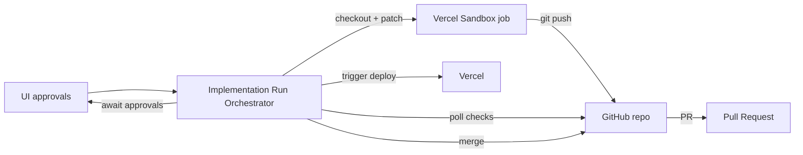

## Status

Accepted — 2026-02-01.

## Description

Implement the “Implementation Run” as a **GitOps** workflow that produces
reviewable, auditable changes via **branches + pull requests** (PRs).

Agents do not “ship directly to production”; they produce PRs, run verification,
and require explicit approvals to merge and deploy.

## Context

The system’s second phase executes the plans it generates: creating/updating a
target application codebase, running verification, and deploying to production.

A naive approach (direct pushes, unreviewed changes, opaque scripts) is high risk
and hard to debug. The implementation layer needs:

- traceability (what changed, why, and which decision/spec it traces to)
- repeatability (idempotent, resumable runs)
- guardrails (approval gates, least privilege, safe execution)

## Decision Drivers

- Security & auditability
- Automation completeness
- DX & maintainability
- Ecosystem alignment (GitHub + Vercel + AI SDK tooling)
- Cost & operational simplicity
- [Regulatory/Policy] Internal approval policy for side-effectful actions
  (**FR-031** / **NFR-013**)

## Alternatives

- A: PR-based GitOps (branches + PRs + checks + approvals)
- Pros: auditable;
  - Reviewable; aligns with common CI/CD.
  - Cons: more moving pieces.
- B: Direct push to default branch
  - Pros: fastest “ship”.
  - Cons: high risk; harder rollback; minimal audit trail.
- C: Patch-only, no GitHub integration
  - Pros: lowest privileges; simplest.
  - Cons: manual work; harder to ensure verification and provenance.

### Decision Framework Score (must be ≥ 9.0)

| Criterion | Weight | Score | Weighted |
| --- | ---: | ---: | ---: |
| Security & auditability | 0.35 | 9.6 | 3.36 |
| DX & maintainability | 0.20 | 9.1 | 1.82 |
| Automation completeness | 0.20 | 9.2 | 1.84 |
| Ecosystem alignment | 0.15 | 9.3 | 1.40 |
| Cost & operational simplicity | 0.10 | 9.0 | 0.90 |
| **Total** | **1.00** | - | **9.32** |

## Considered Options

### Option A — PR-based GitOps (chosen)

- **Agents**
  - Create a branch per implementation run (or per major task group).
  - Apply atomic commits with structured messages that reference artifacts.
  - **Open a PR** and attach:
    - Implementation plan and task checklist
    - Verification results
    - Provenance (run id, sandbox job ids, tool logs)
  - **Merge and deploy** are **gated** by explicit approvals (UI).
  - **Rollbacks** follow normal Git workflows (revert/rollback commit).

### Option B — Direct push to default branch

- Agents commit directly to `main` and deploy automatically.

### Option C — Patch-only, no GitHub integration

- Agents generate diffs for the user to apply manually outside the system.

## Decision

We will adopt **PR-based GitOps delivery** to address safe, reviewable agentic
implementation. This involves using **branches + pull requests (GitHub)** and
**sandboxed verification jobs (Vercel Sandbox)** configured with **explicit
approval gates** and **required checks** before merge/deploy.

Choose **Option A — PR-based GitOps** as the canonical delivery mechanism for
agentic implementation.

## Constraints

- Never merge to the default/protected branch, create tags, or perform
  destructive repo operations without explicit approvals (**FR-031**).
- Pushing to a run-scoped branch is allowed without approval strictly to enable
  PR creation (still subject to redaction, least privilege, and required checks
  before merge).
- With PAT-based auth, assume “read CI signals, don’t write CI signals”:
  GitHub’s Checks API write access is limited to GitHub Apps; plan around that
  by reading check runs and using provider-native CI rather than creating
  custom check runs. See [GitHub REST API: Check runs](https://docs.github.com/en/rest/checks/runs).
- Must support branch protections and required status checks (do not bypass).
- Never persist repo secrets in the database (tokens, SSH keys, deploy keys).

## High-Level Architecture

## Related Requirements

### Functional Requirements

- **FR-023:** Durable Implementation Run workflow.
- **FR-024:** Machine-readable plan traceable to artifacts.
- **FR-025:** Apply code changes and manage PRs.
- **FR-026:** Execute verification in sandboxed compute.
- **FR-029:** Monitor external progress (checks, deploys).
- **FR-031:** Approval gate for side-effectful operations.
- **FR-034:** Deterministic implementation audit bundle.

### Non-Functional Requirements

- **NFR-013:** Least privilege and explicit gating of unsafe tools.
- **NFR-014:** Sandbox isolation for untrusted code execution.
- **NFR-015:** Auditability of side-effectful actions.

### Performance Requirements

- **PR-005:** Steps are idempotent and safe to retry (branch/PR operations
  should be resumable).
- **PR-006:** CI completes within 10 minutes (p95) for typical PRs.
- **PR-007:** Support hours-long workflows with queued steps and sandbox jobs.

### Integration Requirements

- **IR-009:** Code execution via Vercel Sandbox.
- **IR-011:** Repo operations via GitHub.
- **IR-012:** Deployments and env var management via Vercel API/SDK.

## Design

### Architecture Overview

- A single Implementation Run owns:
  - a workspace checkout (in Sandbox)
  - a branch name derived from the run id
  - one PR (or a small, bounded set) for review and approvals
- The orchestrator persists external IDs (repo, branch, PR number, commit SHAs,
  check suite IDs, deployment IDs) in run step logs.

### Implementation Details

- Repo operations use Octokit for:
  - creating/updating branches
  - opening PRs and updating PR descriptions
  - polling check suites / check runs and mergeability
- Verification runs in Sandbox using Bun-only commands for the target repo:
  `bun run format`, `bun run lint`, `bun run typecheck`, `bun run test`,
  `bun run build` (or repo-specific equivalents).
- On failure, the system posts a structured summary into the PR description or
  a PR comment, and halts awaiting user action/approval.

### Configuration

- GitHub integration is feature-gated by env vars (see
  [ADR-0021](ADR-0021-environment-configuration-contracts-and-secret-handling.md)):
  - `GITHUB_TOKEN` (fine-grained PAT recommended)
  - `GITHUB_WEBHOOK_SECRET` (optional; inbound webhook verification)

## Testing

- Unit: stub Octokit client and assert correct API calls per workflow step.
- Integration: run against a dedicated test repository with branch protections.
- Security: ensure tokens never enter logs, DB artifacts, or PR bodies.

## Implementation Notes

- Run any repo checkout, patch application, or verification in Vercel Sandbox;
  avoid running untrusted code in the app runtime.
- Use GitHub APIs (via Octokit) for PR creation/merge and status polling.
- Map approval gates to explicit UI actions, not hidden “agent discretion”.

## Consequences

### Positive Outcomes

- Clear audit trail: PRs, commits, checks, and deployments provide traceability.
- Safer default: approval gates prevent destructive or expensive side effects.
- Aligns with existing CI/CD tooling (GitHub checks, Vercel deployments).
- Supports long runs: work can pause awaiting checks/approval, then resume.

### Negative Consequences / Trade-offs

- Requires GitHub credentials.
- More moving pieces (branches, PR states, check statuses).

### Ongoing Maintenance & Considerations

- Keep “repo state machine” transitions explicit and resumable (e.g. “branch
  created”, “PR opened”, “checks green”, “awaiting approval”, “merged”).
- Support migration from PAT to GitHub App auth without redesigning the flow.

### Mitigations

- Implement a credential-provider abstraction:
  - start with fine-grained PATs
  - allow GitHub App credentials later without redesign
- Provide a “dry-run” mode that generates PR content without pushing, for
  debugging and trust-building.
- Persist all repo actions and external IDs in run step logs.

### Dependencies

- **Added**: @octokit/rest

## Changelog

- **0.1 (2026-02-01)**: Initial version.
