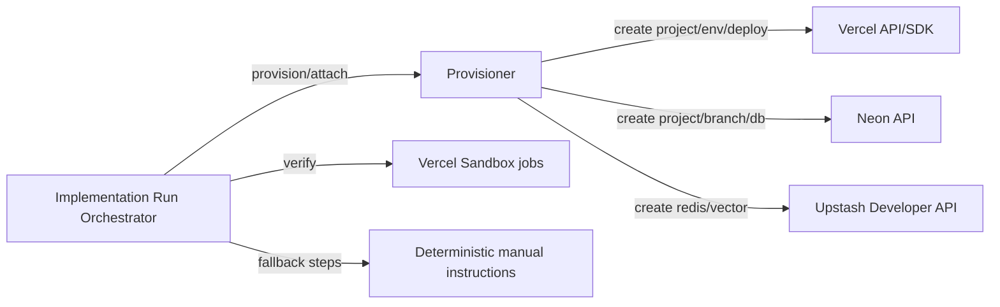

## Status

Accepted — 2026-02-01.

## Description

Automate target-app infrastructure and deployments using provider APIs when
credentials are available, with an explicit fallback path that generates exact
manual steps when automation cannot be performed.

“Automation when possible” is critical for scaling workflows, but the system
must remain usable when some provider APIs are unavailable (e.g. account type
limitations) or tokens are intentionally omitted.

## Context

Implementation runs need to reliably produce a deployed system, not just code.
That includes:

- provisioning/connecting databases and queues
- setting environment variables
- creating deployment projects and triggering production deployments
- capturing provenance (resource IDs, regions, connection strings)

Provider constraints differ:

- Vercel provides a REST API and a typed TypeScript SDK.
- Neon provides an API for projects/branches/databases.
- Upstash provides per-database REST tokens for runtime access, but the Upstash
  Developer API (provisioning) is only available to native Upstash accounts
  (Upstash Developer API — native accounts only: <https://upstash.com/docs/common/account/developerapi>).

## Decision Drivers

- End-to-end automation coverage
- Security & least privilege
- Portability & fallback UX
- DX & maintainability
- Cost & ops simplicity
- [Regulatory/Policy] Internal approval policy for side-effectful actions
  (**FR-031** / **NFR-013**)

## Alternatives

- A: Provider APIs + typed SDKs with fallback — Pros: automation when possible;
  consistent UX; minimal additional infra. Cons: multiple tokens and changing
  API surfaces.
- B: Terraform / Pulumi — Pros: repeatable IaC, state management. Cons: heavy
  operational overhead; state secrets; higher setup friction.
- C: Manual-only provisioning — Pros: minimal permissions; simplest. Cons:
  slow; error-prone; hard to guarantee end-to-end “ship”.

### Decision Framework Score (must be ≥ 9.0)

| Criterion | Weight | Score | Weighted |
| --- | ---: | ---: | ---: |
| End-to-end automation coverage | 0.30 | 9.2 | 2.76 |
| Security & least privilege | 0.25 | 9.3 | 2.33 |
| DX & maintainability | 0.20 | 9.0 | 1.80 |
| Portability & fallback UX | 0.15 | 9.2 | 1.38 |
| Cost & ops simplicity | 0.10 | 9.0 | 0.90 |
| **Total** | **1.00** | - | **9.17** |

## Considered Options

### Option A — Provider APIs + typed SDKs, with fallback (chosen)

- Vercel: use `@vercel/sdk` (or REST) to create/configure projects and env vars.
- Neon: use Neon API to create projects/branches/databases when `NEON_API_KEY`
  is present.
- Upstash: use Developer API to provision resources only when compatible and
  credentials exist; otherwise guide manual setup (or Vercel Marketplace).
- Persist only **non-secret** metadata in DB; secrets remain environment-only.

### Option B — Terraform / Pulumi for everything

- Use IaC to provision Vercel/Neon/Upstash and store state.

### Option C — Manual-only provisioning

- System generates instructions; user provisions everything manually.

## Decision

We will adopt **provider-API-driven provisioning and deployment automation**
to address end-to-end “ship” workflows for target apps. This involves using
**Vercel API/SDK**, **Neon API**, and (optionally) **Upstash Developer API**
configured with **feature-gated credentials**, **deterministic fallbacks**, and
**explicit approvals** for side-effectful actions.

Choose **Option A**.

## Constraints

- Never persist secrets in DB (tokens, connection strings, private keys); store
  only non-secret metadata and external IDs.
- Enforce explicit approvals for side-effectful operations (provisioning,
  deletion, prod deploys) (**FR-031**).
- Support partial credentials: missing tokens must disable UI affordances and
  provide deterministic manual steps instead of “half failing”.
- Upstash provisioning via Developer API depends on account type; automation
  must fall back to manual setup when unsupported.

## High-Level Architecture

## Related Requirements

### Functional Requirements

- **FR-023:** Durable Implementation Run workflow.
- **FR-026:** Execute verification in sandboxed compute and persist results.
- **FR-027:** Provision/connect required infrastructure and persist non-secret
  metadata.
- **FR-028:** Create/configure deployment target and promote to production.
- **FR-029:** Monitor external progress until completion.
- **FR-031:** Approval gate for side-effectful operations.
- **FR-034:** Deterministic implementation audit bundle.

### Non-Functional Requirements

- **NFR-001:** Protect server-only keys and secrets.
- **NFR-013:** Least privilege for provider credentials.
- **NFR-015:** Auditability for side-effectful actions and external IDs.

### Performance Requirements

- **PR-005:** Provisioning steps are idempotent and safe to retry.
- **PR-007:** Support hours-long workflows via queued steps and sandbox jobs.

### Integration Requirements

- **IR-009:** Code execution via Vercel Sandbox.
- **IR-012:** Deployments and env var management via Vercel API/SDK.
- **IR-013:** Optional provisioning via Neon API.
- **IR-014:** Optional provisioning via Upstash Developer API.

## Design

### Architecture Overview

- A provisioner module owns:
  - provider client initialization (feature-gated by env vars)
  - idempotent “ensure resource exists” operations
  - recording external IDs and non-secret metadata into run steps/artifacts
- A manual fallback generator produces copy/paste steps with explicit
  placeholders, ordered to minimize mistakes.

### Implementation Details

- Vercel project management:
  - create/find project
  - create/upsert environment variables per target (preview/production)
  - create deployments and poll readiness
- Neon provisioning:
  - create a project and branch (or attach existing)
  - derive connection details for `DATABASE_URL` without persisting secrets
- Upstash provisioning:
  - provision Redis and Vector only when Developer API is available; otherwise,
    fall back to manual setup and/or Marketplace guidance

### Configuration

- Provisioning and deployment automation is feature-gated by env vars (see
  [ADR-0021](ADR-0021-environment-configuration-contracts-and-secret-handling.md)):
  - `VERCEL_TOKEN` (and optional `VERCEL_TEAM_ID`)
  - `GITHUB_TOKEN` (for repos connected via GitHub)
  - optional provisioning:
    - `NEON_API_KEY`
    - `UPSTASH_EMAIL`, `UPSTASH_API_KEY`

## Testing

- Unit: provider client wrappers validate payload shapes and error normalization.
- Contract: idempotency (re-run “ensure” calls does not create duplicates).
- Integration: smoke provision a Vercel project + set env vars in a test team.
- Security: verify secrets never enter DB logs/artifacts.

## Implementation Notes

- Store external IDs and URLs for:
  - Vercel projects/deployments
  - Neon projects/branches/databases
  - Upstash DB/index IDs (if provisioned via Developer API)
- Do not persist secrets (tokens, connection strings) in DB.
- Any destructive action (delete resources, rotate tokens) requires explicit
  approval.

## Consequences

### Positive Outcomes

- Enables “one-click” (or minimal-click) deployments when tokens are present.
- Keeps the app usable under partial integrations (fallback instructions).
- Uses maintained first-party interfaces where possible (`@vercel/sdk`, Neon API).
- Maintains clear separation: secrets are env-only; DB stores only IDs/metadata.

### Negative Consequences / Trade-offs

- Requires multiple provider tokens for full automation.
- Provider API surfaces change; requires upkeep.

### Ongoing Maintenance & Considerations

- Keep provider clients isolated behind stable internal interfaces.
- Treat provisioning as “best effort with deterministic fallback”, not a hard
  requirement for running Implementation Runs.

### Mitigations

- Centralize provider clients behind a single `integrations/*` module layer.
- Feature-gate integrations via env parsing; disable UI affordances if missing.
- Add contract tests for provisioning modules.

### Dependencies

- **Added**: @vercel/sdk, @neondatabase/api-client (optional), @upstash/redis, @upstash/vector

## Changelog

- **0.1 (2026-02-01)**: Initial version.
