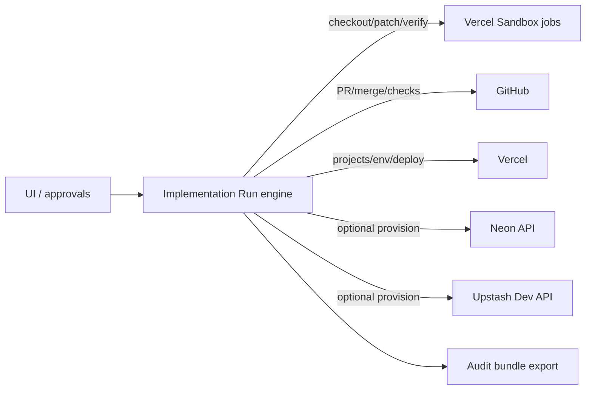

## Summary

Define a durable **Implementation Run** that can execute a project’s generated
artifacts into a production-ready target application:

- repo preparation and indexing
- plan generation (traceable to artifacts)
- patch application and verification in sandboxed compute
- PR creation and approval-gated merges
- infrastructure provisioning/connection
- deployment and post-deploy validation
- final audit bundle export

## Context

The system’s “implementation phase” turns generated artifacts into a deployed
target application. This requires durable orchestration, safe execution, and
auditability across external systems (GitHub, Vercel, optional provisioning)
(see [GitHub REST API](https://docs.github.com/en/rest),
[Vercel REST API](https://vercel.com/docs/rest-api), and
[Terraform docs](https://developer.hashicorp.com/terraform/docs)).

## Goals / Non-goals

### Goals

- **Durable** across disconnects and serverless execution limits.
- **Auditable**: every side effect and external ID is persisted.
- **Safe by default**: approvals required for merges/provisioning/deploy.
- **Traceable**: changes reference artifact IDs/versions.
- **Scalable**: supports long workflows (hours) and many steps.
- **Deterministic export** of implementation provenance.

### Non-goals

- Running arbitrary, unreviewed autonomous changes without an approval gate.
- Replacing CI platforms; we integrate with them.
- Supporting arbitrary git providers beyond GitHub initially.

## Requirements

Requirement IDs are defined in `docs/specs/requirements.md`.

### Functional requirements

- **FR-022:** Connect a target application repository to a project and persist
  repo metadata.
- **FR-023:** Start a durable Implementation Run workflow (plan → code → verify → deploy).
- **FR-024:** Generate a machine-readable implementation plan traceable to artifacts.
- **FR-025:** Apply code changes and manage pull requests for review/approval.
- **FR-026:** Execute verification in sandboxed compute and persist results.
- **FR-027:** Provision/connect required infrastructure and persist non-secret metadata.
- **FR-028:** Create/configure deployment target (Vercel) and promote to production.
- **FR-029:** Monitor external progress (checks/deployments) until completion/failure.
- **FR-030:** Persist implementation artifacts (patches, transcripts, reports, links).
- **FR-031:** Enforce an approval gate for side-effectful operations.
- **FR-032:** Index target repo source code for retrieval to support code-aware agents.
- **FR-033:** Support multi-agent orchestration for implementation with least-privilege tools.
- **FR-034:** Generate an implementation audit bundle (deterministic export of provenance).

### Performance / Reliability requirements (if applicable)

- **PR-007:** Support hours-long workflows via queued steps and sandbox jobs.

### Integration requirements (if applicable)

- **IR-009:** Code execution via Vercel Sandbox.
- **IR-011:** Repo operations via GitHub (API + Git over HTTPS).
- **IR-012:** Deployments and env var management via Vercel API/SDK.

## Constraints

- Side-effectful operations (push/merge/provision/deploy/delete) must be approval-gated.
- Secrets are env-only; persist only non-secret metadata and external IDs.
- Verification and untrusted code execution run in Sandbox, not app runtime.
- Runs must be resumable and idempotent across retries and disconnects.

## Decision Framework Score (must be ≥ 9.0)

| Criterion | Weight | Score | Weighted |
| --- | --- | ---: | ---: |
| Solution leverage | 0.35 | 9.1 | 3.19 |
| Application value | 0.30 | 9.3 | 2.79 |
| Maintenance & cognitive load | 0.25 | 9.0 | 2.25 |
| Architectural adaptability | 0.10 | 9.1 | 0.91 |

**Total:** 9.14 / 10.0

## Design

### Architecture overview

### Data contracts (if applicable)

- Run/step persistence extends `runs` + `run_steps` (see [SPEC-0005](./SPEC-0005-durable-runs-orchestration.md)).
- Implementation artifacts are versioned artifacts (see [SPEC-0008](./SPEC-0008-artifact-generation-versioning-and-export-zip.md)).

### File-level contracts

- `docs/architecture/spec/SPEC-0016-implementation-runs-end-to-end-build-and-deploy.md`: canonical state machine definition.
- `docs/architecture/spec/SPEC-0017-repo-ops-and-github-integration.md`: branch/PR/checks details.
- `docs/architecture/spec/SPEC-0018-infrastructure-provisioning-and-secrets-for-target-apps.md`: provisioning + secrets mapping.
- `docs/architecture/spec/SPEC-0019-sandbox-build-test-and-ci-execution.md`: standardized sandbox job definitions.

### Configuration

- Feature-gated credentials (see [SPEC-0015](./SPEC-0015-environment-configuration-contracts.md) and `docs/ops/env.md`):
  - GitHub: `GITHUB_TOKEN` (optional `GITHUB_WEBHOOK_SECRET`)
  - Vercel API: `VERCEL_TOKEN` (optional `VERCEL_TEAM_ID`)
  - Sandbox: `VERCEL_OIDC_TOKEN` (preferred) or `VERCEL_TOKEN` + `VERCEL_PROJECT_ID`
  - Optional provisioning: `NEON_API_KEY`, `UPSTASH_EMAIL` + `UPSTASH_API_KEY`

## Concepts

- **Implementation Run**: `runs.type = "implementation"`.
- **Target repo**: the GitHub repository connected to the project.
- **Workspace checkout**: a sandbox-local clone of the repo for the duration of a
  sandbox job.
- **Patchset**: ordered commits/diffs produced by the run.
- **Verification suite**: lint/typecheck/test/build and optional DB migrations.
- **Approval gate**: explicit user approval required before side effects.

## Run lifecycle (state machine)

### States

- `created` → `running` → (`waiting_approval` | `waiting_external`) → `running`
  → (`succeeded` | `failed` | `canceled`)

### Required steps (baseline pipeline)

1. **Preflight**
   - validate project artifacts exist (PRD/SPEC/ADRs)
   - validate repo is connected (FR-022)
   - validate required integrations are enabled for desired automation
   - enforce budgets ([SPEC-0010](./SPEC-0010-observability-budgets-and-cost-controls.md))

2. **Repo prepare**
   - ensure repo exists and is accessible
   - create a run branch name: `agent/<projectSlug>/<runId>`
   - checkout in sandbox, create branch

3. **Repo indexing (optional but recommended)**
   - chunk codebase incrementally
   - embed and index in Upstash Vector under a repo namespace (FR-032)

4. **Plan generation**
   - produce a machine-readable plan:
     - tasks (id, title, description)
     - acceptance criteria
     - file path targets
     - verification expectations
     - references to artifact versions (FR-024)

5. **Implementation loop**
   For each task:
   - retrieve relevant repo context (vector + file reads)
   - generate a patch (unified diff and/or commit-level plan)
   - apply patch in sandbox checkout
   - run bounded verification for the task
   - if passes: commit with structured message
   - if fails: analyze, fix, retry within budgets

6. **Full verification**
   - run full suite: lint + typecheck + tests + build
   - persist verification report artifact

7. **PR creation**
   - open PR from run branch → default branch
   - attach audit metadata and links
   - persist PR number/URL

8. **Approval gate (merge)**
   - require user approval to merge
   - optionally require all checks passing

9. **Provisioning/connect infra**
   - optionally provision Neon/Upstash resources if credentials present
   - otherwise generate manual steps and pause for user completion
   - persist non-secret resource metadata

10. **Deploy to production**
    - set env vars (no secrets stored in DB)
    - trigger deployment and poll until ready
    - persist deployment provenance

11. **Post-deploy validation**
    - health checks
    - optional Playwright e2e smoke test (if configured)

12. **Finalize**
    - generate final audit bundle artifact
    - mark run succeeded

## Approvals and safety

### Side-effect categories

- `repo.push` (pushing commits to remote)
- `repo.merge` (merging PR)
- `infra.provision` (creating/updating external infra)
- `deploy.production` (promoting to prod)
- `infra.delete` / `repo.delete` (destructive)

### Policy

- Defaults require approval for all categories.
- UI supports “approve this action” and “approve remaining actions in this run”
  (dangerous; requires a second confirmation).
- All approved actions are logged with: who approved, when, intent, parameters
  (redacted), resulting external IDs.

## Data persistence (high level)

Implementation runs reuse the `runs` and `run_steps` model from
[SPEC-0005](./SPEC-0005-durable-runs-orchestration.md).

Add run step payload conventions:

- `run_steps.inputs` contains:
  - artifact references (kind/key/version)
  - repo state (owner/name, branch, base SHA)
  - budgets
- `run_steps.outputs` contains:
  - PR info (number/url)
  - commit SHAs
  - sandbox job metadata (job id, exit code, logs ref)
  - deployment metadata
  - infra resource IDs

## UI requirements

- “Implementation” tab per project
  - connect/create repo
  - choose automation level (manual vs provider API)
  - run configuration (budgets, approvals)
  - start run
- Run timeline view
  - steps with status
  - transcripts and diffs
  - approvals panel
  - external links (PR, deployment)

## Acceptance criteria

- An Implementation Run can proceed from plan → PR → deploy with explicit approval gates.
- Every side effect is logged with provenance (PR/commit/deployment/infra IDs).
- Verification runs in Sandbox and produces a persisted report artifact.
- A deterministic audit bundle can be exported for a completed run.

## Testing

- Unit tests: state machine transitions and idempotency helpers.
- Integration tests: RepoOps and Sandbox job stubs validate orchestration.
- E2E (later): run against a test repo with protected branches and a test Vercel project.

## Operational notes

- Prefer small tasks with bounded verification to reduce failure blast radius.
- Treat “resume” as a first-class operation (pause on approvals/external waits).

## Failure modes and mitigation

- Verification fails → persist logs, halt run, and propose patch fixes within budgets.
- GitHub checks never go green → surface failing checks and stop at merge gate.
- Deployment fails → persist deployment logs/URL, halt, and offer rollback plan.

## Key files

- `docs/architecture/spec/SPEC-0016-implementation-runs-end-to-end-build-and-deploy.md`
- `docs/architecture/spec/SPEC-0017-repo-ops-and-github-integration.md`
- `docs/architecture/spec/SPEC-0018-infrastructure-provisioning-and-secrets-for-target-apps.md`
- `docs/architecture/spec/SPEC-0019-sandbox-build-test-and-ci-execution.md`

## References

- Durable runs: [SPEC-0005](./SPEC-0005-durable-runs-orchestration.md)
- Sandbox verification jobs: [SPEC-0019](./SPEC-0019-sandbox-build-test-and-ci-execution.md)
- GitOps decision: [ADR-0024](../adr/ADR-0024-gitops-repository-automation-pr-based-workflows.md)
- Provisioning/deploy decision: [ADR-0025](../adr/ADR-0025-infrastructure-provisioning-and-vercel-deployment-automation.md)
- GitHub REST API: https://docs.github.com/en/rest
- Vercel REST API: https://vercel.com/docs/rest-api
- Terraform docs: https://developer.hashicorp.com/terraform/docs

## Changelog

- **0.1 (2026-02-01)**: Initial draft.
