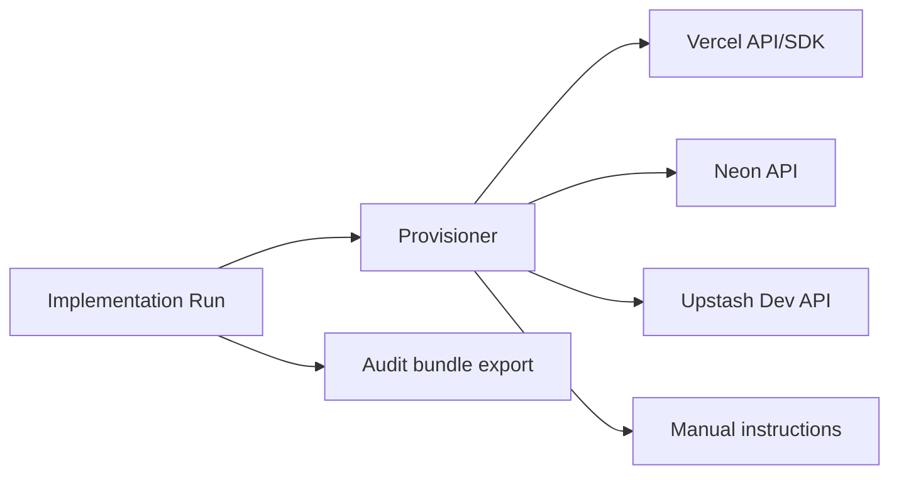

## Summary

Define how Implementation Runs provision or connect infrastructure and configure
deployments.

See [SPEC-0021](./SPEC-0021-full-stack-finalization-fluid-compute-neon-upstash-ai-elements.md)
for the cross-cutting “finalization” plan that ties provisioning and env var
contracts back to the runtime app stack (Neon/Drizzle, Upstash, AI Gateway, UI).

Core principle: **never store secrets in the DB**. The system stores only
non-secret metadata and external IDs.

## Context

Implementation Runs must deliver a deployed target app, not just code changes.
Provisioning and deployment automation varies by provider and account type, so
the system must support partial automation with deterministic manual fallback.

## Goals / Non-goals

### Goals

- Provision/connect required infra and configure deployments without persisting secrets.
- Support manual, assisted, and automated modes per integration.
- Persist provenance (external IDs/URLs) for audit bundle export.

### Non-goals

- Full IaC state management (Terraform/Pulumi) inside this app.
- Automatic destructive operations (resource deletion) by default.

## Requirements

Requirement IDs are defined in [docs/specs/requirements.md](/docs/specs/requirements.md).

### Functional requirements

- **FR-027:** Provision or connect required infrastructure for the target app
  and persist non-secret resource metadata.
- **FR-028:** Create and configure a deployment target (Vercel project), set
  environment variables, and promote deployments to production.
- **FR-031:** Enforce an approval gate for side-effectful operations.
- **FR-034:** Generate an implementation audit bundle with infra/deploy provenance.

### Non-functional requirements

- **NFR-013 (Least privilege):** Provider credentials are scoped to minimum
  required permissions; unsafe tools are gated by explicit approvals.
- **NFR-015 (Auditability):** All side-effectful actions are logged with intent,
  parameters (redacted), and resulting external IDs.

### Integration requirements (if applicable)

- **IR-012:** Deployments and env var management via Vercel API/SDK.
- **IR-013:** Optional: Provision Neon resources via Neon API.
- **IR-014:** Optional: Provision Upstash resources via Upstash Developer API.

## Constraints

- Never store secrets (tokens, connection strings, private keys) in the DB.
- All side-effectful operations (provisioning, env var writes, production deploy)
  require explicit approvals.
- Automation must degrade gracefully when provider APIs are unavailable.

## Decision Framework Score (must be ≥ 9.0)

| Criterion | Weight | Score | Weighted |
| --- | --- | ---: | ---: |
| Solution leverage | 0.35 | 9.1 | 3.19 |
| Application value | 0.30 | 9.2 | 2.76 |
| Maintenance & cognitive load | 0.25 | 9.0 | 2.25 |
| Architectural adaptability | 0.10 | 9.1 | 0.91 |

**Total:** 9.11 / 10.0

## Design

### Architecture overview

### Data contracts (if applicable)

- Target app env contract (conceptual):
  - `key`, `scope` (build/runtime), `secret` (boolean), `source` (manual|detected|provisioned)
- Provisioning provenance (conceptual):
  - `provider`, `resourceType`, `externalId`, `region`, `urls[]`, `createdAt`

### File-level contracts

- [docs/architecture/spec/SPEC-0018-infrastructure-provisioning-and-secrets-for-target-apps.md](/docs/architecture/spec/SPEC-0018-infrastructure-provisioning-and-secrets-for-target-apps.md): canonical mapping rules.
- [docs/architecture/adr/ADR-0025-infrastructure-provisioning-and-vercel-deployment-automation.md](/docs/architecture/adr/ADR-0025-infrastructure-provisioning-and-vercel-deployment-automation.md): provisioning automation decision.
- [docs/architecture/adr/ADR-0021-environment-configuration-contracts-and-secret-handling.md](/docs/architecture/adr/ADR-0021-environment-configuration-contracts-and-secret-handling.md): env/secret handling policy.

### Configuration

- Feature-gated credentials (see [docs/ops/env.md](/docs/ops/env.md)):
  - Vercel API: `VERCEL_TOKEN` (optional `VERCEL_TEAM_ID`)
  - Optional Neon provisioning: `NEON_API_KEY`
  - Optional Upstash provisioning: `UPSTASH_EMAIL` + `UPSTASH_API_KEY`

## Provisioning modes

Implementation runs support three provisioning modes per integration:

1. **Manual**: generate exact instructions and pause for user completion.
2. **Assisted**: validate existing resources (connection test) and generate env
   mappings.
3. **Automated**: provision via provider APIs when credentials are present and
   user approves.

## Providers

### Vercel (deployment target)

- Create/configure Vercel projects
- Set environment variables
- Trigger deployments and poll status
- Store project + deployment IDs/URLs as metadata (not secrets)

### Neon (database)

- Automated provisioning uses Neon API when `NEON_API_KEY` is present.
- Resource model:
  - Neon project
  - branch (per environment)
  - database (per app)
- Connection strings are secrets and must only be written to Vercel env vars or
  presented once for manual copy/paste.
- Target apps deployed on Vercel should default to Postgres TCP + connection
  pooling on Fluid compute (instead of per-request connections), and attach the
  pool via `attachDatabasePool` for correct idle connection handling.
  - [Neon: Connecting to Neon from Vercel](https://neon.com/docs/guides/vercel-connection-methods)
  - [Vercel Functions package reference](https://vercel.com/docs/functions/functions-api-reference/vercel-functions-package)
- This app consumes the runtime connection string exclusively via `DATABASE_URL`
  (see `src/db/client.ts` and `src/lib/data/*.server.ts`); the DB stores only
  non-secret metadata and external IDs.

### Upstash (cache/queue/vector)

- Runtime access uses per-database REST tokens.
- Automated provisioning uses Upstash Developer API **only** when compatible and
  `UPSTASH_EMAIL` + `UPSTASH_API_KEY` are present.
- If the account is created via a third-party integration (e.g., Vercel
  Marketplace), Developer API may be unavailable; fall back to manual steps.

## Environment variable mapping

Implementation runs maintain a “target app env contract” record per project:

- required env vars for target app
- sources:
  - generated artifacts/specs
  - detected repo framework (Next.js, etc.)
  - provisioning outputs

The system must support:

- generating `.env.example` updates for the target repo
- setting Vercel env vars via API (approval-gated)
- redacting sensitive values from logs and artifacts

## Vercel deployment automation

Minimum automation:

1. Ensure Vercel project exists and is linked to GitHub repo
2. Set env vars
3. Trigger deployment
4. Poll deployment status and URL
5. Promote to production when required by policy

## Provenance capture

Persist and export:

- provider resource IDs
- regions
- timestamps
- deployment URLs
- PR/commit SHAs that produced the deployment

## Safety and approvals

All provisioning and deployment operations require explicit approval.

Default policies:

- No destructive operations (delete resources) in automated mode.
- Rotating credentials is manual-only initially.

## Acceptance criteria

- Provisioning never persists secrets in DB logs/artifacts.
- Manual fallback instructions are deterministic and complete enough to execute.
- Automated mode records external IDs/URLs and can resume on retries.

## Testing

- Unit tests: env var mapping logic and redaction behavior.
- Integration tests: Vercel env var upsert and deployment polling against a test project.
- Security tests: ensure secrets never appear in persisted artifacts.

## Operational notes

- Prefer “ensure” semantics (idempotent) for provisioning operations.
- Treat production deploy as an approval-gated operation with clear rollback steps.

## Failure modes and mitigation

- Provider API unavailable → fall back to manual instructions and pause.
- Partial provisioning succeeds → persist provenance and continue only when safe.
- Env var misconfiguration → fail fast on verification/health checks and surface remediation.

## Key files

- [docs/architecture/spec/SPEC-0018-infrastructure-provisioning-and-secrets-for-target-apps.md](/docs/architecture/spec/SPEC-0018-infrastructure-provisioning-and-secrets-for-target-apps.md)
- [docs/architecture/adr/ADR-0025-infrastructure-provisioning-and-vercel-deployment-automation.md](/docs/architecture/adr/ADR-0025-infrastructure-provisioning-and-vercel-deployment-automation.md)
- [docs/ops/env.md](/docs/ops/env.md)

## References

- [Vercel REST API](https://vercel.com/docs/rest-api)
- [Vercel TypeScript SDK](https://github.com/vercel/sdk)
- [Neon API](https://neon.com/docs/api)
- [Upstash Developer API](https://upstash.com/docs/common/account/developerapi)

## Changelog

- **0.1 (2026-02-01)**: Initial draft.
- **0.1.1 (2026-02-03)**: Linked to SPEC-0021 as the cross-cutting finalization spec.
