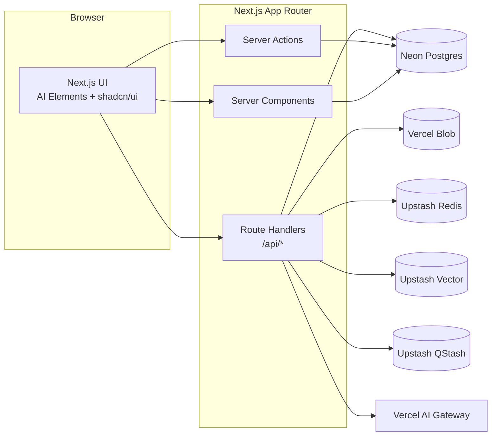

## Summary

This spec is the “stitching document” that finalizes the end-to-end system:

- **Persistence**: Neon Postgres via Drizzle ORM, on Vercel **Fluid Compute** using `pg` pooling + `attachDatabasePool`. [^vercel-attach-db-pool] [^vercel-fluid-compute]
- **Ingestion**: Blob → extract → chunk → embed → Upstash Vector, with idempotency and bounded costs.
- **Retrieval**: project-scoped search and retrieval tool(s), with Redis caching.
- **Durable orchestration**: QStash-signed route handlers + a step engine, persisted in DB.
- **UI**: Next.js App Router workspace that uses **AI Elements** (chat/streaming/workflow UI) + shadcn/ui (everything else).

This spec explicitly documents:

- what is already implemented (code snapshot)
- what remains (decision-complete implementation plan)
- how Vercel/Neon/Upstash environments and secrets should be configured

## Scope / Non-goals

### In scope

- Bring the repo to a “production-ready, final-release” posture for the DB + RAG + workflows + UI stack.
- Document Vercel Fluid Compute implications and required patterns (pooling, Node runtime).
- Define the final UI/UX information architecture and the API contracts it requires.
- Define integration test coverage (DB, ingestion, retrieval, QStash signature verification).

### Out of scope (explicitly deferred)

- Multi-tenant authorization model (this app is single-user by default).
- Public sign-up (see ADR-0023).
- Full Playwright E2E suite (we define the plan and the minimum smoke tests; expanding to full E2E is a follow-on).

## Current Implementation Snapshot (Repo Truth)

This section is the authoritative snapshot of the current repository state as of **2026-02-03**.

### Database (Neon + Drizzle)

- Schema: `src/db/schema.ts`
- Migrations: `src/db/migrations/**`
- Runtime client: `src/db/client.ts`
  - Uses `pg` pooling with `drizzle-orm/node-postgres`
  - On Vercel Fluid Compute, attaches the pool with `attachDatabasePool` (`@vercel/functions`). [^vercel-attach-db-pool]
- Integration test (gated by `DATABASE_URL`): `tests/integration/db.test.ts`

### Ingestion pipeline (Blob → extract → chunk → embed → vector)

- Upload Route Handler: `src/app/api/upload/route.ts`
  - Uploads to Vercel Blob (original preserved)
  - Writes DB metadata (including sha256 idempotency)
  - Supports inline ingestion or async ingestion via QStash (`?async=true`)
- Ingest worker (QStash-signed): `src/app/api/jobs/ingest-file/route.ts`
- Extraction: `src/lib/ingest/extract/extract-document.server.ts`
- Chunking: `src/lib/ingest/chunk/chunk-document.server.ts`
- Orchestrator: `src/lib/ingest/ingest-file.server.ts`
- Embeddings (AI Gateway): `src/lib/ai/embeddings.server.ts`
- Vector client: `src/lib/upstash/vector.server.ts`
- Budgets: `src/lib/config/budgets.server.ts`

### Retrieval + search

- Retrieval tool wrapper: `src/lib/ai/tools/retrieval.server.ts`
  - Optional Redis caching (if configured)
  - Enforces top-k bounds and project scoping
- Search Route Handler (minimal): `src/app/api/search/route.ts`
  - Project-scoped: Upstash Vector query
  - Global: Postgres metadata search (projects)

### Durable runs / orchestration

- Runs Route Handler: `src/app/api/runs/route.ts`
- Step worker (QStash-signed): `src/app/api/jobs/run-step/route.ts`
- Step engine (placeholder graph; must be expanded): `src/lib/runs/run-engine.server.ts`
- DAL:
  - `src/lib/data/projects.server.ts`
  - `src/lib/data/files.server.ts`
  - `src/lib/data/runs.server.ts`
- QStash helpers: `src/lib/upstash/qstash.server.ts`

### UI (Not Yet Implemented)

- No workspace pages under `src/app/(app)/…` exist yet (planned in this spec).
- shadcn/ui + AI Elements component code is not yet vendored into the app.

## Target Architecture (Final System Shape)



## Vercel Runtime & Fluid Compute Requirements

### Node.js runtime required for DB work

All DB and ingestion routes that depend on `pg`/Drizzle must execute on Node.js runtime (not Edge).

### Pooling policy (Fluid Compute)

- Create a single `pg` Pool per module instance.
- Immediately call `attachDatabasePool(pool)` so idle clients are released before a function suspends.
  - Reference: Vercel Functions package `attachDatabasePool` docs.
    - [Vercel Functions package reference](https://vercel.com/docs/functions/functions-api-reference/vercel-functions-package).

### Fluid Compute enablement

Fluid Compute is enabled by default for new Vercel projects, but can be explicitly controlled per project via `vercel.json`. [^vercel-fluid-compute] [^vercel-vercel-json]

```jsonc
{
  "$schema": "https://openapi.vercel.sh/vercel.json",
  "fluid": true
}
```

Reference: [Vercel Fluid Compute](https://vercel.com/docs/fluid-compute)

## Environments, Branching, and Secrets (Vercel + Neon + Upstash)

This section is decision-complete for how environments should work across local
development, Vercel Preview deployments, and Production.

### Environment tiers

We use Vercel’s standard env tiers and keep the contracts aligned with
`docs/ops/env.md` and `src/lib/env.ts` (ADR-0021 / SPEC-0015):

- **Development**: local dev + `vercel dev` + Vercel “Development” env vars.
- **Preview**: per-branch deployments (and, when enabled, per-branch Neon DB branch).
- **Production**: stable, production deployment + production resources.

### Neon ↔ Vercel integration (recommended)

Use the Neon marketplace integration with Preview Branching enabled when
possible. [^neon-vercel-integration]

- `DATABASE_URL` is injected per Preview branch automatically.
- When Neon Auth is enabled, `NEON_AUTH_BASE_URL` is also injected per Preview branch.

References:

- [Neon on Vercel integration](https://neon.com/docs/guides/vercel)
- [Neon “Vercel connection methods”](https://neon.com/docs/guides/vercel-connection-methods)

### Upstash integration (recommended)

Use Vercel Marketplace integrations for: [^vercel-upstash-marketplace]

- Upstash Redis (caching)
- Upstash Vector (retrieval)
- Upstash QStash (durable workflows)

The REST tokens are secrets and must be configured via Vercel environment
variables. Tokens can be shared across environments, but production should
prefer production-scoped resources and tokens.

### Env var matrix (minimum required)

These are “minimum required for full functionality” env vars. Each group is
feature-gated in `src/lib/env.ts` and documented in `docs/ops/env.md`.

- **DB**:
  - `DATABASE_URL`
- **AI Gateway**:
  - `AI_GATEWAY_API_KEY`
  - optional overrides:
    - `AI_GATEWAY_BASE_URL`
    - `AI_GATEWAY_CHAT_MODEL`
    - `AI_GATEWAY_EMBEDDING_MODEL`
- **Blob**:
  - `BLOB_READ_WRITE_TOKEN`
- **Upstash Vector**:
  - `UPSTASH_VECTOR_REST_URL`
  - `UPSTASH_VECTOR_REST_TOKEN`
- **Upstash Redis** (optional but strongly recommended for cost control):
  - `UPSTASH_REDIS_REST_URL`
  - `UPSTASH_REDIS_REST_TOKEN`
- **Upstash QStash** (required for async ingestion and durable runs):
  - publish:
    - `QSTASH_TOKEN`
  - verify (inbound webhooks):
    - `QSTASH_CURRENT_SIGNING_KEY`
    - `QSTASH_NEXT_SIGNING_KEY`

### CLI playbooks (verifiable commands)

These command families are the supported operational workflows for provisioning
and inspecting resources during implementation and runbooks.

#### Vercel CLI

Vercel CLI is the primary way to align local `.env.local` with a linked Vercel project:

- Link the repo to a Vercel project:
  - `vercel link`
- Pull development env vars into `.env.local`:
  - `vercel env pull`
- Manage env vars:
  - `vercel env add`
  - `vercel env update`
  - `vercel env remove`
  - `vercel env list`

Reference: `vercel env --help`

#### Neon CLI

Neon CLI supports scripting and CI/CD:

- Authenticate:
  - `neon auth`
  - or via `NEON_API_KEY` for non-interactive usage
- Projects:
  - `neon projects list`
  - `neon projects create`
  - `neon projects get <id>`
- Branches:
  - `neon branches list --project-id <id>`
  - `neon branches create --project-id <id>`
- Connection strings:
  - `neon connection-string --project-id <id> --pooled --ssl require`

Notes:

- Official docs commonly refer to this CLI as `neonctl`; in this repo’s dev
  environment it is installed as `neon`.
- Do not paste API keys into artifacts or logs.

References:

- [Neon CLI reference](https://neon.com/docs/reference/neon-cli)

#### Drizzle / drizzle-kit

Use Bun scripts (repo standard):

- Generate migrations:
  - `bun run db:generate`
- Apply migrations:
  - `bun run db:migrate`
- Drizzle Studio:
  - `bun run db:studio`

Direct CLI reference:

- `bunx drizzle-kit --help`

## Model Access: AI Gateway Defaults (Final Decision)

Per ADR-0007, all model access is through AI Gateway. This spec sets the final default model IDs:

- Default chat model: `xai/grok-4.1-fast-reasoning` [^ai-gateway-grok-fast-reasoning]
- Default embedding model: `alibaba/qwen3-embedding-4b` [^ai-gateway-qwen-embedding]

Verification command (do not hardcode based on memory; confirm at implementation time):

```bash
curl -s https://ai-gateway.vercel.sh/v1/models | jq -r '[.data[] | select(.id | startswith("xai/")) | .id] | sort | .[]'
```

Embedding model verification command:

```bash
curl -s https://ai-gateway.vercel.sh/v1/models | jq -r '[.data[] | select(.id | startswith("alibaba/")) | .id] | sort | .[]'
```

## API Contracts (Current + Required Additions)

This section documents the current API surface (repo truth) and the required
additions to complete the UI.

### Uploads: `POST /api/upload` (implemented)

Request: `multipart/form-data`

- `projectId`: string (required)
- `file`: File (one or many; required)
- `async`: `"true"` or `"false"` (optional; when `true`, try QStash and fall back to inline locally)

Response:

- `{ files: ProjectFileDto[] }` (with optional `ingest.chunksIndexed` when inline ingestion runs)

Code: `src/app/api/upload/route.ts`

### Search: `GET /api/search` (implemented)

Query params:

- `q`: string (required)
- `projectId`: string (optional)
  - If provided: project-scoped vector retrieval results.
  - If omitted: metadata search over projects.

Code: `src/app/api/search/route.ts`

### Runs: `POST /api/runs` (implemented)

Body (JSON):

- `projectId`: string
- `kind`: `"research"` | `"implementation"`
- `metadata`: object (optional)

Code: `src/app/api/runs/route.ts`

### Durable workers (implemented)

- `POST /api/jobs/ingest-file`
  - QStash-signed ingestion worker (async ingestion)
- `POST /api/jobs/run-step`
  - QStash-signed run step executor (durable runs)

### Chat: `POST /api/chat` (required; not yet implemented)

Must be implemented to support the AI Elements chat UI:

- Streaming response via `createAgentUIStreamResponse`
- Agent runtime via `ToolLoopAgent`
- Retrieval tool integration via `src/lib/ai/tools/retrieval.server.ts`
- Model selection via env:
  - `AI_GATEWAY_CHAT_MODEL` (default: `xai/grok-4.1-fast-reasoning`)

ADR sources:

- [AI SDK ToolLoopAgent](https://ai-sdk.dev/docs/reference/ai-sdk-core/tool-loop-agent)
- [Streaming UI responses](https://ai-sdk.dev/docs/reference/ai-sdk-core/create-agent-ui-stream-response)

## UI/UX Finalization (AI Elements + shadcn/ui)

This app’s UI must make all major capabilities discoverable and fast:

- Project workspace with deep-linkable tabs:
  - Overview
  - Uploads
  - Chat
  - Runs
  - Search
  - Settings (budgets / integrations status)

### UI principles (non-negotiable)

- Default to Server Components for data reads; use Client Components only for interactive surfaces.
- Avoid waterfalls: start independent server work early, `Promise.all` where safe.
- No manual memoization (`useMemo`, `useCallback`).
- No barrel files / no new barrel imports.

### AI Elements usage

AI Elements must be used as the primary primitive set for:

- chat message rendering (assistant/user/tool parts)
- streaming markdown rendering (via Streamdown where appropriate)
- workflow/run visualization and step timelines (use the AI Elements workflow example as baseline)

Source index (AI Elements docs): [AI Elements docs](https://elements.ai-sdk.dev/llms.txt)

### AI Elements component set (required)

When implementing the UI in Phase 1–3, vendor these AI Elements components
(names are from AI Elements docs; install via the AI Elements CLI):

- Chat:
  - `Conversation`
  - `Message` (and subcomponents like `MessageContent`, `MessageResponse`)
  - `PromptInput` (composer)
  - `Reasoning`
  - `Sources`
- Runs (workflow visualization):
  - `Canvas` (React Flow-based)
  - `Node`
  - `Edge`
  - `Controls`
  - `Connection`

Reference: AI Elements workflow example: [^ai-elements-workflow]

- [AI Elements workflow example](https://elements.ai-sdk.dev/examples/workflow)

## Next.js Cache Components (Partial Prerendering)

Enable Cache Components and adopt `'use cache'` for deterministic server loaders, while keeping request-scoped UI dynamic sections under Suspense boundaries.

Local Next.js docs index for this repo: `./.next-docs` (see `AGENTS.md`).

## Testing Requirements (Minimum “Final” Bar)

### Integration tests

- DB integration test (already present):
  - Runs only when `DATABASE_URL` is set.
  - Applies migrations and performs CRUD.
- QStash signature verification contract tests:
  - Unsigned requests must be rejected with 401/403.
- Ingestion integration test:
  - Given a small text fixture, extraction → chunking → embedding (mock) → vector upsert (mock) persists expected DB state.

### Unit tests

- Chunking determinism and stable chunk IDs.
- Budget enforcement for retrieval top-k, embedding batch size, upload limits.

### Build gates

- `bun run ci` must pass.

## Implementation Plan (Decision-Complete)

This plan enumerates all remaining work to reach “finalized” status. It is written so implementation requires no further decisions.

### Phase 0 — Documentation alignment (this change set)

- Add this spec (SPEC-0021) and update existing ADRs/SPECs to match repo paths (`*.server.ts`), and to reference SPEC-0021 where it becomes the integrator spec.

### Phase 1 — UI + AI Elements foundation

1. Install and initialize shadcn/ui with Tailwind v4, using Bun.
2. Vendor AI Elements components into `src/components/ai-elements/**` using `ai-elements` CLI.
3. Implement workspace pages under `src/app/(app)/projects/**`:
   - `src/app/(app)/projects/page.tsx` (project list)
   - `src/app/(app)/projects/[projectId]/layout.tsx` (tabs)
   - `src/app/(app)/projects/[projectId]/uploads/page.tsx`
   - `src/app/(app)/projects/[projectId]/chat/page.tsx`
   - `src/app/(app)/projects/[projectId]/runs/page.tsx`
   - `src/app/(app)/projects/[projectId]/search/page.tsx`
4. Implement a minimal settings surface for budgets and integrations status.

### Phase 2 — Chat Route Handler + ToolLoopAgent wiring

1. Add `src/app/api/chat/route.ts`:
   - streams with `createAgentUIStreamResponse`
   - uses `ToolLoopAgent`
   - uses `AI_GATEWAY_CHAT_MODEL` defaulting to `xai/grok-4.1-fast-reasoning`
   - includes retrieval tool `retrieveProjectChunks` (server-only)
2. Add message persistence to DB (thread + messages tables) or explicitly document the deferred plan if schema is not yet present.

### Phase 3 — Runs engine (real graph) + workflow UI

1. Expand `src/lib/runs/run-engine.server.ts` from placeholder to a real step DAG aligned with SPEC-0005.
2. Ensure each step is idempotent and persisted in DB.
3. Add UI to display run timelines and step details; reuse AI Elements workflow primitives.

## Citations

[^vercel-attach-db-pool]: <https://vercel.com/docs/functions/functions-api-reference/vercel-functions-package>
[^vercel-fluid-compute]: <https://vercel.com/docs/fluid-compute>
[^vercel-vercel-json]: <https://vercel.com/docs/project-configuration/vercel-json>
[^neon-vercel-integration]: <https://neon.com/docs/guides/vercel>
[^vercel-upstash-marketplace]: <https://vercel.com/changelog/upstash-joins-the-vercel-marketplace>
[^ai-gateway-grok-fast-reasoning]: <https://vercel.com/ai-gateway/models/grok-4.1-fast-reasoning>
[^ai-gateway-qwen-embedding]: <https://vercel.com/ai-gateway/models/qwen3-embedding-4b>
[^ai-elements-workflow]: <https://ai-sdk.dev/elements/examples/workflow>

### Phase 4 — Cache Components enablement

1. Update `next.config.ts` to enable `cacheComponents: true`.
2. Refactor stable server loaders to `'use cache'` and tag invalidation on upload/runs as needed.

### Phase 5 — Test coverage completion

1. Add integration tests for ingestion + QStash signature verification.
2. Add contract tests for `/api/upload`, `/api/search`, `/api/runs` validation and auth.
3. Ensure the “env var contract” is updated when defaults change:
   - `src/lib/env.ts`
   - `.env.example`
   - `docs/ops/env.md`
   - `src/lib/env.test.ts`

## References

- [Vercel Fluid Compute](https://vercel.com/docs/fluid-compute)
- [attachDatabasePool](https://vercel.com/docs/functions/functions-api-reference/vercel-functions-package)
- [Neon on Vercel connection methods](https://neon.com/docs/guides/vercel-connection-methods)
- [Neon + Drizzle guide](https://neon.com/docs/guides/drizzle)
- [Upstash Vector hybrid indexes](https://upstash.com/docs/vector/features/hybridindexes)
- [QStash Next.js quickstart](https://upstash.com/docs/qstash/quickstarts/vercel-nextjs)
- [AI Gateway models endpoint](https://ai-gateway.vercel.sh/v1/models)
- [AI Elements docs index](https://elements.ai-sdk.dev/llms.txt)

## Changelog

- **0.1.0 (2026-02-03)**: Initial full-stack finalization spec (documents current repo snapshot + decision-complete remaining work).
